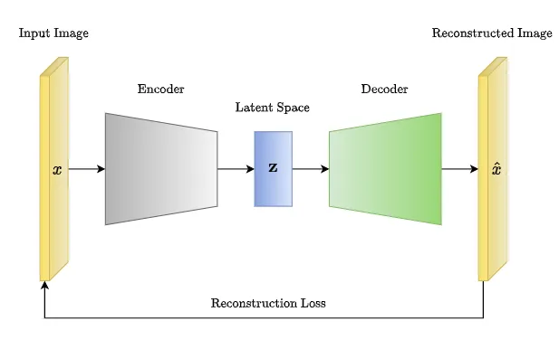
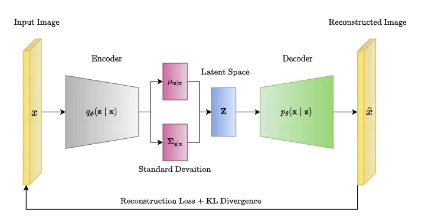
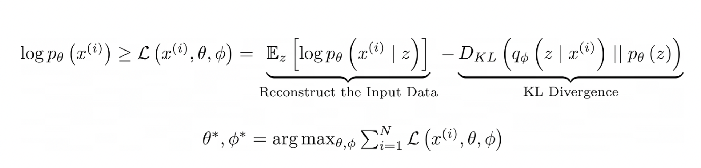

Autoencoders (AE), Variational Autoencoders (VAE), and β-VAE are all generative models used in unsupervised learning. Regardless of the architecture, all these models have so-called encoder and decoder structures. AE is a deterministic model, while VAE and β-VAE are both probabilistic models based on the generalized EM (Expectation Maximization) algorithm.

**AutoEncoder**

Core Idea: Compression and Reconstruction

The fundamental principle of an autoencoder is to learn a compressed representation of input data and then use that representation to reconstruct the original data as accurately as possible. This is achieved through two main components:

**Encoder**:

- The encoder consists of a series of neural network layers which extract features from an image and embed or encode them to a low-dimensional latent space.
- If the encoder consists of a series of Convolution Layers, the resulting architecture is sometimes called CNN-VAE.
- This part of the network takes the input data (such as an image, text, or other types of data) and compresses it into a lower-dimensional representation called the latent space or bottleneck.
- The encoder typically consists of multiple layers of neurons, with each layer progressively reducing the dimensionality of the data.
- The specific types of layers used in the encoder can vary depending on the data and task, but common choices include fully connected layers for simple data, and convolutional layers for images.

**Decoder**:

- The decoder consists of a series of neural network layers which attempt to recreate the original image from the low-dimensional latent space.
- The architecture of the decoder is generally diverging. It is not necessary that the encoder and decoder have the same architecture, but in practice, they are usually kept the same.
- This part of the network takes the compressed representation from the latent space and attempts to reconstruct the original input data.
- The decoder mirrors the structure of the encoder, but in reverse. It progressively increases the dimensionality of the data until it matches the original input.
- Similar to the encoder, the decoder can use various types of layers, such as fully connected layers or transposed convolutional layers (also known as deconvolutional layers) for images.

**Training an Autoencoder**

- The objective of training an autoencoder is to minimize the difference between the input data and its reconstructed output, which is typically measured using a loss function such as mean squared error or binary cross-entropy.

- An autoencoder is trained in an unsupervised manner, meaning it doesn't require labeled data. The training process involves:

Feeding input data: The encoder compresses the input into the latent space.
Reconstruction: The decoder attempts to reconstruct the original input from the latent representation.
Loss calculation: A loss function, such as mean squared error (MSE) or cross-entropy, measures the difference between the reconstructed output and the original input.
Backpropagation: The network updates its weights through backpropagation to minimize the reconstruction loss.

**Types of Autoencoders**

There are several variations of autoencoders, each with specific properties and applications:

- Undercomplete Autoencoders: The latent space is smaller than the input and output dimensions, forcing the network to learn a compressed representation.
- Overcomplete Autoencoders: The latent space is larger than the input dimension, potentially allowing for more expressive representations but also prone to overfitting.
- Denoising Autoencoders: The input is corrupted with noise, and the network learns to reconstruct the clean original, effectively performing denoising.
- Variational Autoencoders (VAEs): Learn a probabilistic distribution of the latent space, enabling generation of new data samples.

**Applications**
Autoencoders have a wide range of applications, including:
- Dimensionality Reduction: Compressing data for visualization or further analysis.
- Feature Extraction: Learning useful representations of data for tasks like classification or clustering.
- Anomaly Detection: Identifying unusual patterns by comparing them to the reconstructed data.
Data Generation: Generating new data samples similar to the training data (in the case of VAEs).

One of the main advantages of autoencoders is their ability to perform unsupervised learning, meaning they can learn to extract meaningful features from raw data without requiring labeled data. This makes them useful for tasks where labeled data is scarce or expensive to obtain. Additionally, autoencoders can be trained using a variety of optimization algorithms, such as stochastic gradient descent and its variants, which can scale to large datasets and high-dimensional input spaces.

However, autoencoders also have some limitations. They are susceptible to overfitting, where the model learns to simply memorize the training data rather than learning to generalize to new data. This can be mitigated by adding regularization techniques such as dropout or early stopping. Additionally, autoencoders can be limited by the size of the compressed representation, as the model needs to strike a balance between preserving the most relevant information in the input and minimizing the reconstruction error.

**Variational Autoencoders**

Variational Autoencoders (VAEs) are a type of autoencoder that was introduced to overcome some limitations of traditional AE. VAEs extend the traditional AE architecture by introducing a probabilistic framework for generating the compressed representation of the input data.

In VAEs, the encoder still maps the input data to a lower-dimensional latent space, but instead of a single point in the latent space, the encoder generates a probability distribution over the latent space. The decoder then samples from this distribution to generate a new data point. This probabilistic approach to encoding the input allows VAEs to learn a more structured and continuous latent space representation, which is useful for generative modeling and data synthesis.

To go from a traditional autoencoder to a VAE, we need to make two key modifications. First, we need to replace the encoder’s output with a probability distribution. Instead of the encoder outputting a point in the latent space, it outputs the parameters of a probability distribution, such as mean and variance. This distribution is typically a multivariate Gaussian distribution but can be some other distribution as well (e.g., Bernoulli).

Second, we introduce a new term in the loss function called the Kullback-Leibler (KL) divergence. This term measures the difference between the learned probability distribution over the latent space and a predefined prior distribution (usually a standard normal distribution). The KL divergence term ensures that the learned distribution over the latent space is close to the prior distribution, which helps regularize the model and ensures that the latent space has a meaningful structure.

The optimized term L in the above equation is called the ELBO (Expectation Lower BOund). The loss function for a VAE is typically composed of two parts: the reconstruction loss (similar to the traditional autoencoder loss) and the KL divergence loss. The reconstruction loss measures the difference between the original input and the output generated by the decoder. The KL divergence loss measures the difference between the learned probability distribution and the predefined prior distribution.

VAEs have several advantages over traditional autoencoders. They allow for generative modeling, meaning they can generate new data points from the learned latent space distribution. They also allow for continuous latent space representations, which means that we can interpolate between different points in the latent space to generate novel data points. Finally, VAEs are less susceptible to overfitting than traditional autoencoders since the probabilistic nature of the encoding forces the model to learn a more robust representation of the data.

However, VAEs can also be more difficult to train and require more computational resources. Additionally, the learned latent space representation can be difficult to interpret, and the quality of generated data can be limited by the model architecture and training data.

