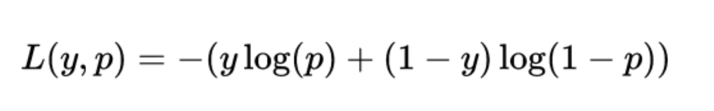
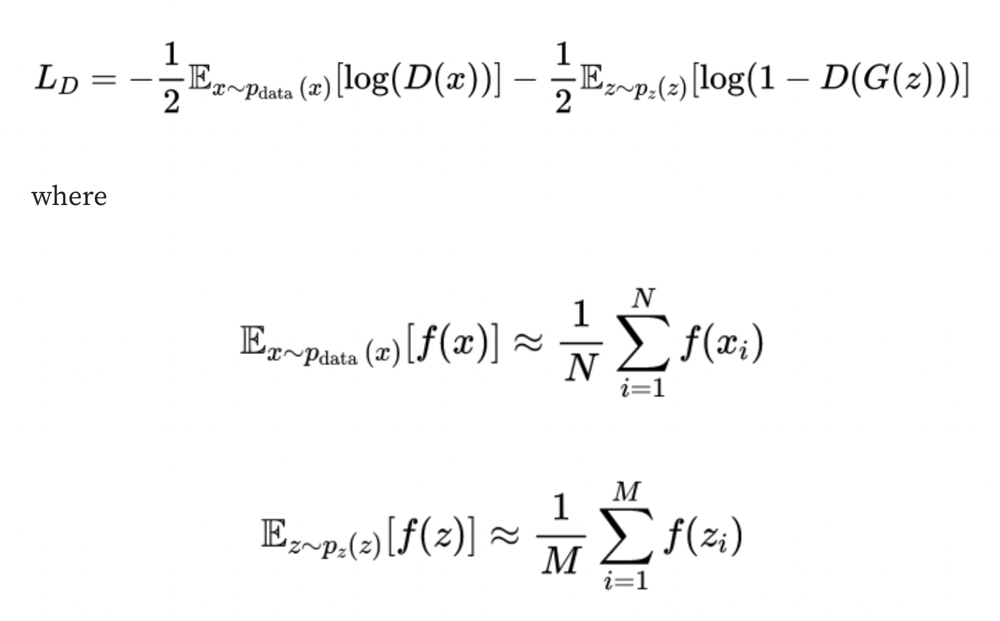

Generative - Generating the data as close to real data 
Adversial - Conflict or Opposition Competing 

A Generative Adversarial Network (GAN) consists of two neural networks, namely the Generator and the Discriminator, which are trained simultaneously through adversarial training. They try to compete with each other. 

**Generator**: This network takes random noise as input and produces data (like images). Its goal is to generate data that’s as close as possible to real data.

**Discriminator**: This network takes real data and the data generated by the Generator as input and attempts to distinguish between the two. It outputs the probability that the given data is real.

* Generetor takes a random noise and produces the data. It passes to descriminator 
* Descriminator takes real image and fake image and try to predict the probability. 
* It then calculates the loss function (Binary Cross entrophy Loss Function) & backpropogates where the generator (calculates its probablity distribution) tries to updates it parameters . Again generates the image 
* Then once we are able to fool the generator we can easily calculate the similarity using some L2 norm.

Loss Function 
Generative Adversarial Networks (GANs) utilize loss functions to train both the generator and the discriminator. The loss function helps adjust the weights of these models during training to optimize their performance. Both the generator and the discriminator use the binary cross-entropy loss to train the models, that can be written as

where:

L(y,p) is the loss value;
y is the true label (either 0 or 1);
p is the predicted probability of the sample belonging to class 1.

**Descriminator**
Discriminator Loss
The discriminator’s goal is to correctly classify real samples as real and fake samples (produced by the generator) as fake. Its loss is typically represented as:

where

x_i​ are samples from the real dataset, N is the number of samples from the real dataset, z_i​ are samples from the noise distribution, and M is the number of samples from the noise distribution.

The first term on the right hand penalizes the discriminator for misclassifying real data, while the second term penalizes the discriminator for misclassifying the fake data produced by the generator.

**Generator Loss**
The generator’s goal is to produce samples that the discriminator incorrectly classifies as real. Its loss is typically represented as:

This term penalizes the generator when the discriminator correctly identifies its outputs as fake.

**Combined Loss**
The combined GAN Loss, often referred to as the minimax loss, is a combination of the discriminator and generator losses. It can be expressed as:

This represents the adversarial nature of GAN training, where the generator and the discriminator are in a two-player minimax game. The discriminator tries to maximize its ability to classify real and fake data correctly, while the generator tries to minimize the discriminator’s ability by generating realistic data.

