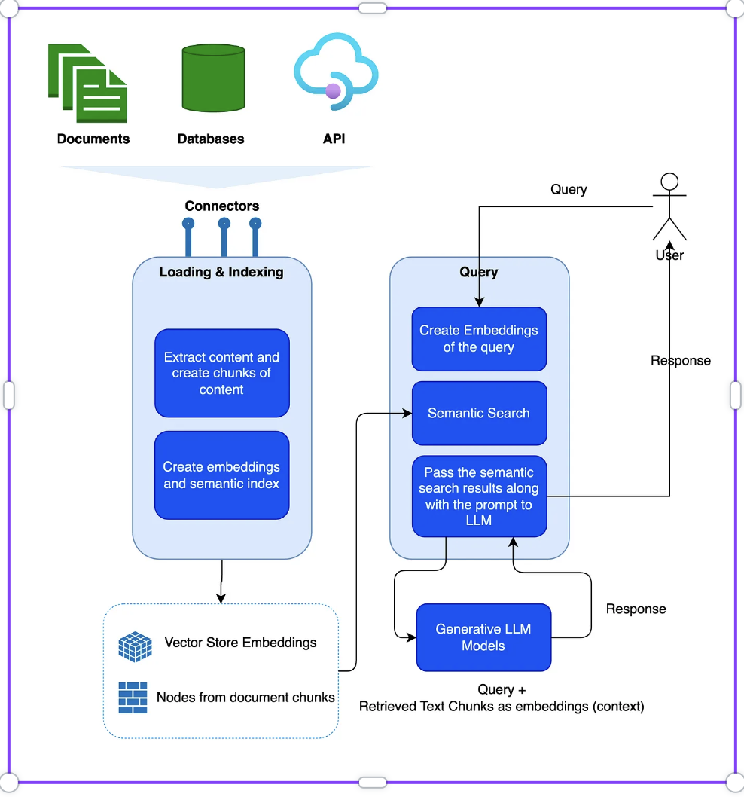
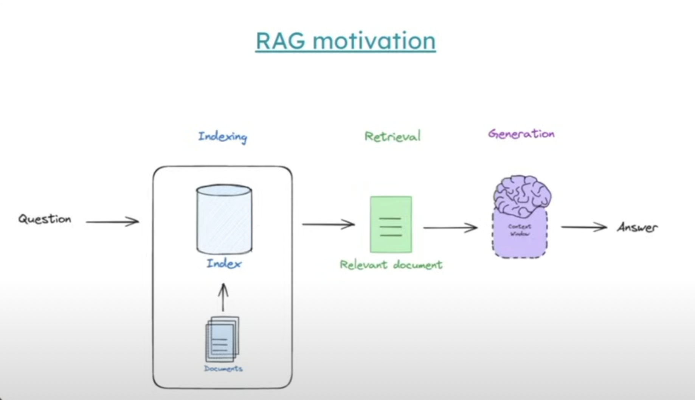
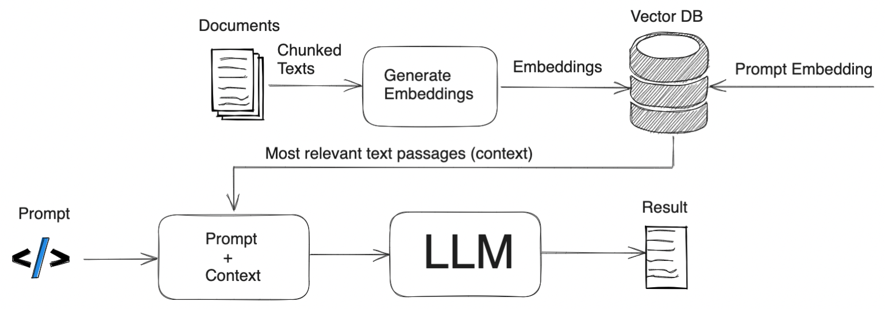

https://www.youtube.com/watch?v=sVcwVQRHIc8&t=2037s&ab_channel=freeCodeCamp.org

Retrieval Augmented Generation (RAG) combines the strengths of both large language models (LLMs) and information retrieval systems to create a more powerful and accurate approach to natural language processing. Here are some of its key benefits:

95% of the World data is private but we can feed it into the LLMs with the help of RAG. So connecting LLMs to extrernal data is the need.

**Increased Accuracy and Reduced Hallucinations**: RAG models have access to a vast external knowledge base, which allows them to generate more accurate and factually correct responses. This reduces the risk of "hallucinations" where LLMs generate plausible-sounding but incorrect information.

**Up-to-date Information**: Unlike traditional LLMs, which are limited to the knowledge they were trained on, RAG models can access the latest information from external sources. This ensures that the generated responses are always current and relevant.

**Better Contextualization**: RAG models can leverage external knowledge to better understand the context of a query, leading to more relevant and meaningful responses. They can also provide citations or references to the sources they used, increasing transparency and trust.

**Enhanced Personalization**: By incorporating user-specific information or preferences from external sources, RAG models can generate more personalized responses that cater to individual needs.

**Reduced Computational Costs**: RAG models can be smaller and less computationally expensive than traditional LLMs since they don't need to store all the knowledge within their parameters. The retrieval step helps to focus the generation process on relevant information, making it more efficient.

**Domain-Specific Expertise**: RAG models can be easily adapted to specific domains by using relevant knowledge bases, allowing them to provide expert-level responses in those areas.

**Improved User Trust**: The ability to provide accurate, up-to-date, and transparent responses with source attribution significantly enhances user trust in the generated content.

In summary, Retrieval Augmented Generation represents a significant advancement in natural language processing. By combining the creativity of LLMs with the factual grounding of information retrieval systems, RAG models offer a more accurate, reliable, and versatile approach to generating text, opening up new possibilities for a wide range of applications.

Embedding models have limited context that's why we chunk.

Retrieval Augmented Generation (RAG) is a framework that combines the strengths of large language models (LLMs) with the power of information retrieval systems to generate more accurate and informed responses. It consists of three main components:

1. Indexing:

This is the process of organizing and storing information in a way that makes it easily searchable. In RAG, indexing involves preparing a knowledge base or corpus of documents that the system will use to retrieve relevant information. This can include various types of data sources such as:

Structured Data: Databases, spreadsheets, etc.
Unstructured Data: Text documents, articles, web pages, etc.
Semi-Structured Data: JSON, XML files, etc.
The indexing process typically involves:

Document Processing: Cleaning, tokenizing, and normalizing the text.
Feature Extraction: Identifying important words, phrases, or concepts.
Indexing Structure Creation: Building an inverted index, vector store, or other suitable data structure to enable efficient retrieval.

2. Retrieval:

Once the information is indexed, the retrieval component is responsible for finding the most relevant documents or passages based on a user's query. This is done using various techniques such as:

Keyword Search: Matching keywords from the query to documents.
Semantic Search: Understanding the meaning of the query and retrieving semantically similar documents.
Dense Passage Retrieval (DPR): Using dense vector representations to find relevant passages.
The retriever often returns a list of top-ranking documents or passages along with their relevance scores.

3. Generation:

The final step involves using a large language model (LLM) to generate a response based on the retrieved information and the user's query. This is where the "augmentation" part of RAG comes in. The LLM is not just generating text from scratch but is also incorporating the relevant information from the retrieved documents.

This can be done in various ways:

Input Augmentation: Appending the retrieved passages to the user's query as context.
Output Augmentation: Conditioning the LLM's output on the retrieved information.
Hybrid Approaches: Combining both input and output augmentation.
The generated response can be further refined using techniques like reranking or filtering to ensure relevance and coherence.

Benefits of RAG:

Improved Accuracy: Access to a broader knowledge base reduces hallucinations and improves factual accuracy.
Up-to-date Information: RAG models can leverage the latest information from external sources.
Contextualization: Better understanding of the query context leads to more relevant responses.
Personalization: Can incorporate user-specific information for tailored responses.
Reduced Computational Cost: Smaller LLMs can be used as they rely on external knowledge.
I hope this explanation clarifies the indexing, retrieval, and generation processes involved in Retrieval Augmented Generation.

**Chroma DB**

Chroma is an open-source embedding database specifically designed for machine learning and artificial intelligence applications. It offers several advantages over traditional databases and other vector databases:

**Ease of use**: Chroma is designed with simplicity in mind. Its intuitive API and straightforward setup make it easy for developers to get started quickly without extensive knowledge of database administration.

**Flexibility**: Chroma offers versatile querying capabilities, supporting complex range searches and combinations of vector attributes. This flexibility makes it suitable for a wide range of applications, including semantic search, recommendation systems, and anomaly detection.

**Open-source**: Being open-source, Chroma benefits fromcommunity contributions, ensuring continuous development and improvements. This also allows for transparency and customization options for users.

**Scalability**: Chroma is built to scale efficiently, handling large volumes of embeddings and queries effectively. This is crucial for applications that deal with massive datasets and require real-time or near-real-time responses.

**Integration with ML frameworks**: Chroma integrates seamlessly with popular machine learning libraries like PyTorch and TensorFlow, simplifying the process of embedding data and incorporating Chroma into existing workflows.

**Cost-effective**: As an open-source solution, Chroma eliminates licensing costs associated with proprietary vector databases, making it a cost-effective option for individuals and organizations.

**Community support**: Chroma has an active and growing community of users and contributors, offering support, tutorials, and resources for those working with the database.

**Optimized for embeddings**: Chroma is specifically tailored to handle embedding vectors, ensuring efficient storage, retrieval, and comparison of these high-dimensional representations.

These advantages make Chroma a compelling choice for developers and organizations seeking a powerful and accessible embedding database for their machine learning projects. Its combination of ease of use, flexibility, scalability, and cost-effectiveness makes it a valuable tool for a wide range of applications.