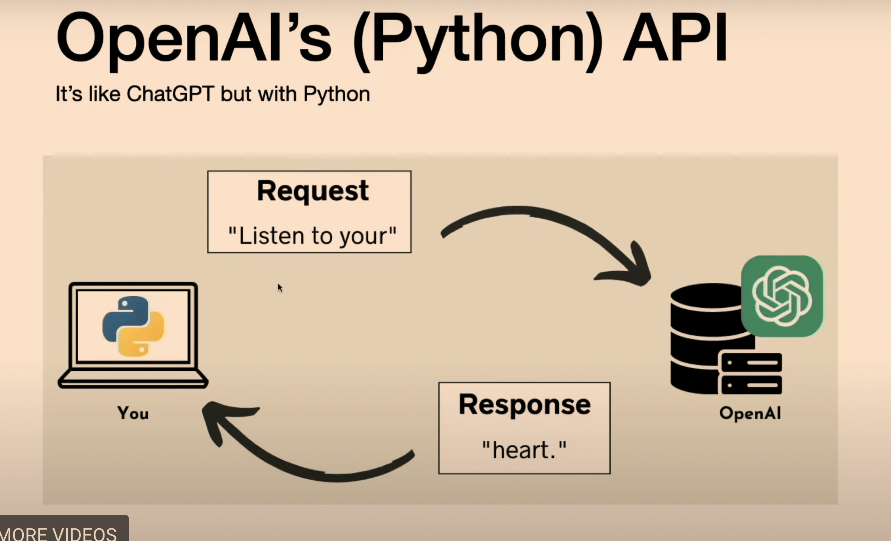
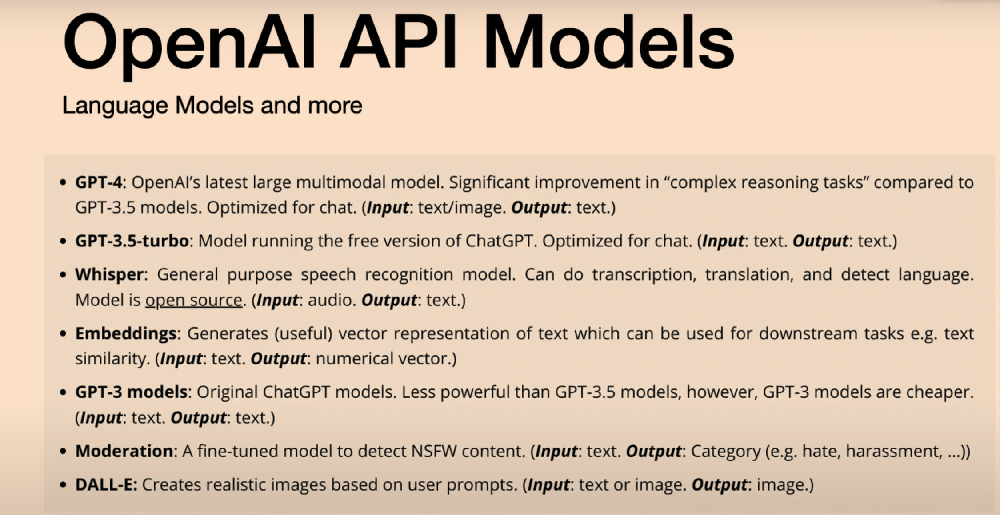
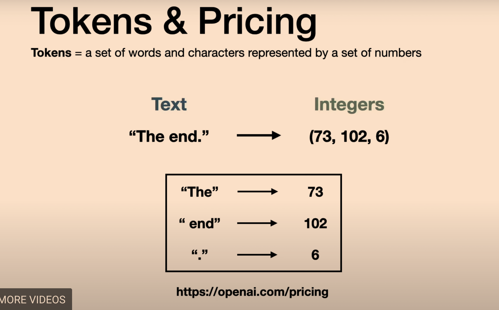

## Demo

[https://huggingface.co/spaces/Jyotiyadav/LangchainOpenAI](https://huggingface.co/spaces/Jyotiyadav/LangchainOpenAI)


### What is an Open API?

An Application Programming Interface (API) is a way to interact with remote applications programmatically.



OpenAI provides an API that allows developers to interact with their language models, including GPT-3.5-Turbo, for various natural language processing tasks.

#### Advantages of using OpenAI API compared to standard ChatGPT:

1. **Customizable System Messages**:
   - OpenAI API allows customization of system messages, providing flexibility in communication.

2. **Adjust Input Parameters**:
   - Parameters such as max response length, number of responses, and temperature can be adjusted to tailor the model's output.

3. **Process Images & other file types**:
   - OpenAI API supports processing images and other file types, expanding its capabilities beyond text.

4. **Extract Helpful Embeddings**:
   - The API enables extraction of embeddings for downstream tasks, enhancing its utility in various applications.

5. **Input Audio for Transcription & Translation**:
   - Audio input is supported for transcription and translation tasks, offering versatility in input formats.

6. **Model Fine-tuning Functionality**:
   - OpenAI API provides functionality for fine-tuning models, allowing customization for specific use cases.



### Token & Pricing

Tokens represent sets of words and characters represented by numbers.



```python
# create a chat completion
chat_completion = openai.ChatCompletion.create(model="gpt-3.5-turbo", 
                                messages=[{"role": "user", "content": "Listen to your"}],
                                max_tokens=2,
                                n=5,
                                temperature=0)


```

### Explanation of Parameters:

- `max_tokens`: Specifies the maximum number of tokens for the completion. How many tokens will be returned
- `n`: Specifies the number of completions to generate. The number of output tokens will be computed.
- `temperature`: Controls the randomness/diversity of the completions/outputs.

### Role & User Explanation:

- The `role` parameter indicates the role of a participant in the conversation (e.g., "user" or "assistant").
- In this context, "user" represents the individual initiating the conversation or providing input.
- The `content` parameter specifies the actual content of the user's message.

Overall, these parameters enable customization of the chat completion process, including controlling the length and diversity of generated completions. Adjusting these parameters can tailor the behavior of the language model to better suit specific requirements or preferences.


### User Message:

The `messages` parameter is a list containing a dictionary representing the user message in the conversation.
In this example, the user message is represented by `{"role": "user", "content": "Listen to your"}`. This indicates that the user's role in the conversation is "user", and the content of the message is "Listen to your".


