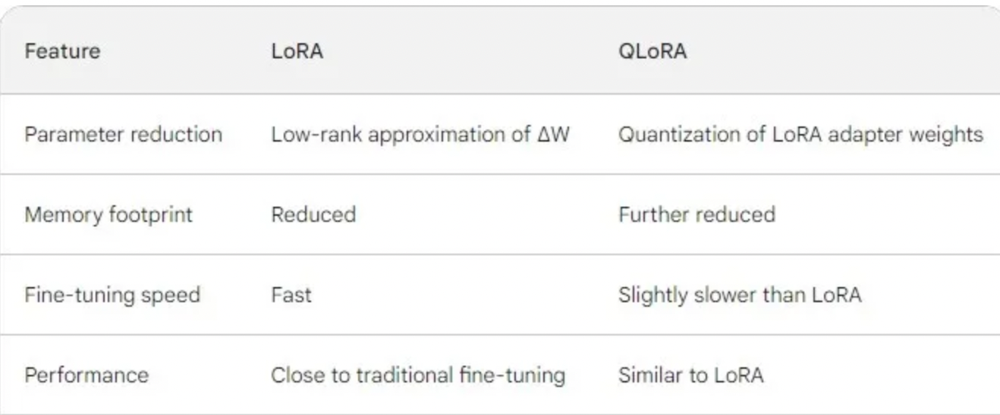

# What are LLMs?

* LLM stands for Large Language Model, a recent innovation in AI and machine learning. 
* Large Language Models (LLMs) are AI models trained on vast amounts of text data to understand and generate human-like language. LLMs, such as GPT-3 (now upgraded to GPT-3.5 or GPT-4),GPT-3.5, LLaMA2, and PaLM2 gained significant attention in December 2022. 

* ChatGPT is a chat interface powered by LLM technology, based on GPT-3, which has undergone upgrades to versions like GPT-3.5 or GPT-4. 
* They have billions or even trillions of parameters, enabling them to capture complex language patterns. 
* LLMs demonstrate strong generalization across various language tasks and domains, generating coherent and contextually relevant text resembling human-written language. 

* LLMs have diverse applications in natural language processing, conversational AI, content generation, and more.

* Large language models (LLM) are very large deep learning models that are pre-trained on vast amounts of data. The underlying transformer is a set of neural networks that consist of an encoder and a decoder with self-attention capabilities. The encoder and decoder extract meanings from a sequence of text and understand the relationships between words and phrases in it.

* Large language models are incredibly flexible. One model can perform completely different tasks such as answering questions, summarizing documents, translating languages and completing sentences

* Large Language Models (LLMs) utilize multi-dimensional vectors known as word embeddings to represent words, allowing them to recognize relationships between words such as contextual meanings. Transformers process text using these word embeddings, enabling LLMs to understand word context and relationships, including parts of speech. This understanding is applied by the model through a decoder to generate unique text outputs.

# What makes an LLM “large”?

A language model is more generic than a large language model. There are two key properties that distinguish LLM from other language models:

* Quantitatively - Number of model parameters i.e. 10 - 100 Billion
* Qualitatively - Emergent properties i.e. zero-shot learning

Zero-shot learning refers to the capability of a machine learning model to complete a task it was not explicitly trained to do.

# How do LLMs work?

* During training, LLMs learn to predict the next word or token in a sequence of text given the preceding context. This task is known as language modeling, where the model learns the probability distribution of the next word given the context of the previous words in the sequence. LLMs are trained using techniques like maximum likelihood estimation or self-supervised learning to optimize this language modeling objective.

* LLM models predominantly use transformer architectures, a type of deep learning architecture optimized for processing sequential data like text.

* Transformers facilitate parallelization and capture long-range dependencies in the data.

# 3 Levels of Using LLMs

* Level 1: Prompt Engineering
* Level 2: Model Fine-tuning
* Level 3: Build your own model

## Level 1: Prompt Engineering

Prompt engineering is the process of refining prompts that a person can input into a generative artificial intelligence (AI) service to generate text or images. Anyone can do this using natural language in generators like ChatGPT and DALL-E.

## Level 2: Model Fine-Tuning

Adjusting at least one (internal) model parameter (but not all) for a particular task.

### What is Fine-tuning?

* Fine-tuning of an LLM model refers to the process of further training the pre-trained model on a specific task or domain using a smaller, task-specific dataset. This process adapts the model's learned parameters to the nuances of the target task or domain, enhancing its performance and applicability for that particular use case.

* Fine-tuning is taking a pre-trained model and training at least one internal model parameter (i.e. weights). In the context of LLMs, what this typically accomplishes is transforming a general-purpose base model (e.g. GPT-3) into a specialized model for a particular use case (e.g. ChatGPT). The key upside of this approach is that models can achieve better performance while requiring (far) fewer manually labeled examples compared to models that solely rely on supervised training.

### Why Fine-tune?

* Improved Performance: Fine-tuning enhances the model's performance for specific tasks or domains.
* Task Specificity: The model becomes more specialized and tailored to handle particular inputs and generate relevant outputs.
* Faster Convergence: Training on a smaller dataset leads to quicker convergence compared to training from scratch.
* Resource Efficiency: It requires fewer computational resources as it builds on pre-existing knowledge.
* Transfer Learning: Leveraging pre-trained knowledge enables effective utilization for specific tasks.
* Customization: Fine-tuning offers flexibility for customization according to specific requirements.
Adaptability: The model can adapt to changes over time by re-training with updated data.

# lama2 Model 

* Developed and publicly released by Meta.
* Llama 2 is a collection of pretrained and fine-tuned generative text models.
* Models range in scale from 7 billion to 70 billion parameters.
* Llama 2 includes the 7B pretrained model converted for the Hugging Face Transformers format.
* Fine-tuned LLMs within Llama 2, named Llama-2-Chat, are optimized for dialogue use cases.
* Llama-2-Chat models outperform open-source chat models on various benchmarks.
* Human evaluations rate Llama-2-Chat models on par with some popular closed-source models like ChatGPT and PaLM in terms of helpfulness and safety.

# PEFT

- **Parameter-Efficient Fine-Tuning (PEFT)**:
  - PEFT methods fine-tune only a small number of extra parameters while freezing most of the pretrained model.
  - This prevents catastrophic forgetting in large models and enables fine-tuning with limited compute.

- **PEFT Library**:
  - PEFT is a library for efficiently adapting large pretrained models to downstream applications.
  - It avoids fine-tuning all parameters due to high computational costs.
  - Instead, it fine-tunes a small number of extra parameters, reducing computational and storage costs.

- **Integration**:
  - PEFT is integrated with the Transformers, Diffusers, and Accelerate libraries.
  - This integration provides a faster and easier way to load, train, and use large models for inference.

# LORA & QLoRA

### LoRA(Low-Rank Adaptation):
* LoRA is an innovative technique designed to efficiently fine-tune pre-trained language models by injecting trainable low-rank matrices into each layer of the Transformer architecture. LoRA aims to reduce the number of trainable parameters and the computational burden while maintaining or improving the model’s performance on downstream tasks.

* Reduces memory footprint: LoRA achieves this by applying a low-rank approximation to the weight update matrix (ΔW). This means it represents ΔW as the product of two smaller matrices, significantly reducing the number of parameters needed to store ΔW.

* Fast fine-tuning: LoRA offers fast training times compared to traditional fine-tuning methods due to its reduced parameter footprint.

* Maintains performance: LoRA has been shown to maintain performance close to traditional fine-tuning methods in several tasks.

### QLoRA(Quantized Low-Rank Adaptation):
* QLoRA is an extension of LoRA that further introduces quantization to enhance parameter efficiency during fine-tuning. It builds on the principles of LoRA while introducing 4-bit NormalFloat (NF4) quantization and Double Quantization techniques.

* Enhances parameter efficiency: QLoRA takes LoRA a step further by also quantizing the weights of the LoRA adapters (smaller matrices) to lower precision (e.g., 4-bit instead of 8-bit). This further reduces the memory footprint and storage requirements.

* More memory efficient: QLoRA is even more memory efficient than LoRA, making it ideal for resource-constrained environments.

* Similar effectiveness: QLoRA has been shown to maintain similar effectiveness to LoRA in terms of performance, while offering significant memory advantages.

# fine-tuned model 

This Python function called tokenize takes a prompt as input and tokenizes it using a pre-trained tokenizer. It ensures the prompt is truncated to a maximum length of 128 tokens, adds an end-of-sequence (EOS) token if specified, and prepares the input in a format suitable for further processing, such as model input. If the prompt doesn't end with an EOS token and is shorter than 128 tokens, and if the option to add an EOS token is enabled, the function appends an EOS token to the input. Finally, it returns the tokenized result containing input IDs, attention mask, and labels.

### Tokenize Function Explanation

This is an explanation of the parameters used in the `tokenize` function:

1. **prompt**: 
   - Input text or prompt to be tokenized.

2. **add_eos_token (default=True)**:
   - Boolean parameter specifying whether to add an end-of-sequence (EOS) token to the tokenized input.
   - True: Add EOS token.
   - False: Do not add EOS token.

3. **result**:
   - Stores the result of tokenization, including input IDs, attention mask, and labels.

4. **truncation (default=True)**:
   - Parameter used by the tokenizer to truncate the input sequence if it exceeds the maximum length.
   - True: Truncate input sequence if it exceeds max_length.
   - False: Do not truncate input sequence.

5. **max_length (default=128)**:
   - Maximum length allowed for the input sequence after truncation.

6. **padding (default=False)**:
   - Parameter used by the tokenizer to add padding tokens to the input sequence to make all input sequences of the same length.
   - True: Add padding tokens.
   - False: Do not add padding tokens.

7. **return_tensors (default=None)**:
   - Type of tensors to return after tokenization.
   - None: Return Python lists or dictionaries containing the tokenized input.
   - Other possible values: "pt" (PyTorch tensors) or "tf" (TensorFlow tensors).

8. **result["input_ids"]**:
   - Tokenized input sequence represented as input IDs.

9. **result["attention_mask"]**:
   - Attention mask for the input sequence, indicating which tokens should be attended to by the model during processing.

10. **result["labels"]**:
    - Tokenized input sequence used as labels during model training. It is a copy of the input IDs and is used for tasks like sequence-to-sequence generation or language modeling.

These parameters control various aspects of the tokenization process, including truncation, padding, and the addition of special tokens like the end-of-sequence token.

## Data Preprocessing Explanation

This code snippet involves data preprocessing steps for a machine learning task, likely involving natural language processing. Here's a breakdown of what each line does:

1. **total_ds = shuffle(df, random_state=42)**:
   - Shuffles the rows of the DataFrame `df` using a random seed of 42.
   - The result is stored in `total_ds`, representing the entire shuffled dataset.

2. **total_train_ds = total_ds.head(4000)**:
   - Selects the first 4000 rows from the shuffled dataset `total_ds`.
   - Assigned to `total_train_ds`, this subset is likely used for training the machine learning model.

3. **total_test_ds = total_ds.tail(1500)**:
   - Selects the last 1500 rows from the shuffled dataset `total_ds`.
   - Assigned to `total_test_ds`, this subset is likely used for evaluating the performance of the trained model.

4. **total_train_ds_hf = Dataset.from_pandas(total_train_ds)**:
   - Creates a Hugging Face Dataset object (`total_train_ds_hf`) from the pandas DataFrame `total_train_ds`.
   - Hugging Face Dataset is a library for managing datasets, especially in the context of natural language processing tasks.

5. **total_test_ds_hf = Dataset.from_pandas(total_test_ds)**:
   - Creates a Hugging Face Dataset object (`total_test_ds_hf`) from the pandas DataFrame `total_test_ds`.

6. **tokenized_tr_ds = total_train_ds_hf.map(generate_and_tokenize_prompt)**:
   - Applies the function `generate_and_tokenize_prompt` to each example in the training dataset (`total_train_ds_hf`).
   - This function likely generates prompts (input sequences) and tokenizes them using a pre-trained tokenizer, preparing the data for model training.

7. **tokenized_te_ds = total_test_ds_hf.map(generate_and_tokenize_prompt)**:
   - Applies the function `generate_and_tokenize_prompt` to each example in the test dataset (`total_test_ds_hf`).
   - Generates and tokenizes prompts for the test dataset, preparing the data for model evaluation.

Overall, this code snippet prepares the dataset for model training and evaluation by shuffling, splitting into training and test subsets, converting them into Hugging Face Dataset objects, and generating/tokenizing prompts for training and testing.

# Training Configuration and Process

## Training Arguments
- `per_device_train_batch_size`: Set to 1, indicating the batch size per GPU during training.
- `gradient_accumulation_steps`: Accumulates gradients over 16 steps before performing a backward pass.
- `learning_rate`: Learning rate set to 4e-05.
- `logging_steps`: Logs training metrics every 50 steps.
- `optim`: Optimizer used for training, specified as "adamw_torch".
- `evaluation_strategy`: Evaluation strategy set to "steps", indicating evaluation at specified steps.
- `save_strategy`: Save strategy set to "steps", indicating model checkpoint saving at specified steps.
- `eval_steps`: Evaluates model performance every 50 steps.
- `save_steps`: Saves model checkpoint every 50 steps.
- `output_dir`: Output directory for saving trained models.

## Data Collator
- `data_collator`: Data collator for sequence-to-sequence tasks using the provided tokenizer.

## Trainer Initialization
- `model`: Model to be trained.
- `tokenizer`: Tokenizer associated with the model.
- `train_dataset`: Tokenized training dataset.
- `eval_dataset`: Tokenized evaluation dataset.
- `args`: Training arguments defined earlier.
- `data_collator`: Data collator for sequence-to-sequence tasks.

## Training Process
- `with torch.autocast("cuda")`: Enables automatic mixed precision training on GPU.
- `trainer.train()`: Initiates the training process.

## Training Progress
- **Step** | **Training Loss** | **Validation Loss**
- 50 | 2.383 | 0.959191
- 100 | 0.440300 | 0.291672
- 150 | 0.265100 | 0.246230

# ROUGE Metrics Overview

ROUGE (Recall-Oriented Understudy for Gisting Evaluation), is a set of metrics and a software package specifically designed for evaluating automatic summarization, but that can be also used for machine translation. The metrics compare an automatically produced summary or translation against reference (high-quality and human-produced) summaries or translations.

In this article, we cover the main metrics used in the ROUGE package.

## ROUGE-N

ROUGE-N measures the number of matching n-grams between the model-generated text and a human-produced reference.

Consider the reference R and the candidate summary C:

R: The cat is on the mat.  
C: The cat and the dog.

### ROUGE-1

Using R and C, we are going to compute the precision, recall, and F1-score of the matching n-grams. Let’s start computing ROUGE-1 by considering 1-grams only.

ROUGE-1 precision can be computed as the ratio of the number of unigrams in C that appear also in R (that are the words “the”, “cat”, and “the”), over the number of unigrams in C.

ROUGE-1 precision = 3/5 = 0.6

ROUGE-1 recall can be computed as the ratio of the number of unigrams in R that appear also in C (that are the words “the”, “cat”, and “the”), over the number of unigrams in R.

ROUGE-1 recall = 3/6 = 0.5

Then, ROUGE-1 F1-score can be directly obtained from the ROUGE-1 precision and recall using the standard F1-score formula.

ROUGE-1 F1-score = 2 * (precision * recall) / (precision + recall) = 0.54

### ROUGE-2

Let’s try computing the ROUGE-2 considering 2-grams.

Remember our reference R and candidate summary C:

R: The cat is on the mat.  
C: The cat and the dog.

ROUGE-2 precision is the ratio of the number of 2-grams in C that appear also in R (only the 2-gram “the cat”), over the number of 2-grams in C.

ROUGE-2 precision = 1/4 = 0.25

ROUGE-2 recall is the ratio of the number of 2-grams in R that appear also in C (only the 2-gram “the cat”), over the number of 2-grams in R.

ROUGE-2 recall = 1/5 = 0.20

Therefore, the F1-score is:

ROUGE-2 F1-score = 2 * (precision * recall) / (precision + recall) = 0.22

## ROUGE-L

ROUGE-L is based on the longest common subsequence (LCS) between our model output and reference, i.e. the longest sequence of words (not necessarily consecutive, but still in order) that is shared between both. A longer shared sequence should indicate more similarity between the two sequences.

We can compute ROUGE-L recall, precision, and F1-score just like we did with ROUGE-N, but this time we replace each n-gram match with the LCS.

Remember our reference R and candidate summary C:

R: The cat is on the mat.  
C: The cat and the dog.

The LCS is the 3-gram “the cat the” (remember that the words are not necessarily consecutive), which appears in both R and C.

ROUGE-L precision is the ratio of the length of the LCS, over the number of unigrams in C.

ROUGE-L precision = 3/5 = 0.6

ROUGE-L precision is the ratio of the length of the LCS, over the number of unigrams in R.

ROUGE-L recall = 3/6 = 0.5

Therefore, the F1-score is:

ROUGE-L F1-score = 2 * (precision * recall) / (precision + recall) = 0.55

## ROUGE-S

ROUGE-S allows us to add a degree of leniency to the n-gram matching performed with ROUGE-N and ROUGE-L. ROUGE-S is a skip-gram concurrence metric: this allows to search for consecutive words from the reference text that appear in the model output but are separated by one-or-more other words.

Consider the new reference R and candidate summary C:

R: The cat is on the mat.  
C: The gray cat and the dog.

If we consider the 2-gram “the cat”, the ROUGE-2 metric would match it only if it appears in C exactly, but this is not the case since C contains “the gray cat”. However, using ROUGE-S with unigram skipping, “the cat” would match “the gray cat” too.

We can compute ROUGE-S precision, recall, and F1-score in the same way as the other ROUGE metrics.

## Pros and Cons of ROUGE

This is the tradeoff to take into account when using ROUGE.

**Pros:** it correlates positively with human evaluation, it’s inexpensive to compute and language-independent.

**Cons:** ROUGE does not manage different words that have the same meaning, as it measures syntactical matches rather than semantics.

## ROUGE vs BLEU

In general:

- BLEU focuses on precision: how much the words (and/or n-grams) in the candidate model outputs appear in the human reference.
- ROUGE focuses on recall: how much the words (and/or n-grams) in the human references appear in the candidate model outputs.

These results are complementing, as is often the case in the precision-recall tradeoff.

## Computing ROUGE with Python

Implementing the ROUGE metrics in Python is easy thanks to the Python rouge library, where you can find ROUGE-1, ROUGE-2, and ROUGE-L. Although present in the rouge paper, ROUGE-S would seem that over time it has been used less and less.

# BLEU

BLEU, or the Bilingual Evaluation Understudy, is a metric for comparing a candidate translation to one or more reference translations. Although developed for translation, it can be used to evaluate text generated for different natural language processing tasks, such as paraphrasing and text summarization.

The BLEU score is not perfect, but it’s quick and inexpensive to calculate, language-independent, and, above all, correlates highly with human evaluation.

## How to Compute the BLEU Score

Consider the two reference translations R1 and R2 produced by human experts, and the candidate translation C1 produced by our translation system.

R1: The cat is on the mat.  
R2: There is a cat on the mat.  
C1: The cat and the dog.

### Computing Unigrams Precision

To express the quality of our translation with a metric, we may count how many words in the candidate translation C1 are present in the reference translations R1 and R2, and divide the result by the number of words in C1 to get a percentage. Therefore, a perfect score is 1.0, whereas the worst score is 0.0. Let’s call this metric BLEU*.

In C1 there are three words (“the”, “cat”, “the”) that appear on the reference translations, thus:

BLEU*(C1) = 3/5 = 0.6

### The Problem with Repeating Unigrams

Let’s compute the BLEU* score of the new candidate translation C2:

R1: The cat is on the mat.  
R2: There is a cat on the mat.  
C2: The The The The The.

This time our translation system is not very good, unfortunately. Every word in C2 is present in at least one between R1 and R2, thus:

BLEU*(C2) = 5/5 = 1

We achieved a perfect score with a non-sense translation, there’s something we need to correct on our metric.

It doesn’t make sense to consider the word “The” five times in the numerator, as it appears at most twice on each reference translation. We can try counting the word “The” only for the times it appears at most on each reference translation, that is two. Let’s call this new metric BLEU**.

BLEU**(C2) = 2/5 = 0.4

### Considering N-Grams

Let’s try computing the BLEU** score on two other candidate translations C3 and C4 to check if everything looks fine.

R1: The cat is on the mat.  
R2: There is a cat on the mat.  
C3: There is a cat on the mat.  
C4: Mat the cat is on a there.

Both candidate translations contain words that are present in the reference translations, therefore they both achieve the maximum score. However, C4 is not a well-formed English sentence.

A quick way to get higher scores for well-formed sentences is to consider matching 2-grams or 3-grams instead of 1-grams only. Let’s call BLEU**₁ the score that considers only 1-grams and BLEU**₂ the score that considers only 2-grams.

It has been found that the geometric mean of the BLEU**ₙ scores with n between one and four has the best correlation with human evaluation, therefore it’s the score more commonly adopted. Let’s call it MEAN_BLEU**.

### Penalizing Short Candidate Translations

Let’s try now computing the BLEU**₁ and BLEU**₂ scores of the candidate translation C5:

R1: The cat is on the mat.  
R2: There is a cat on the mat.  
C5: There is a cat.

Looks like C5 achieves a perfect BLEU**ₙ score for each n, even though the candidate translation is missing a piece of text with respect to the reference translations.

This can be avoided by adding a penalty for candidate translations whose length is less than the ones of the reference translations. We call it Brevity Penalty (BP).

The final BLEU score is:

BLEU = BP * MEAN_BLEU**

That is, BLEU is the product of the Brevity Penalty BP (which penalizes short translations that don’t contain relevant text from the reference translations) and the geometric mean of the BLEU**ₙ scores for n between one and four (which takes into account small n-grams, to capture the sentence meaning, and large n-grams, to get well-formed sentences).

What is the value of BP?

If the length of the candidate solution is bigger than the length of the reference translation with the most similar length, then we shouldn’t penalize and therefore BP equals one. Otherwise, BP is a decaying exponential which is lower when the length difference between the candidate and the reference translations is greater. The BLEU paper suggests computing the brevity penalty over the entire corpus rather than over single translations to smoothen the penalties for short translations.
