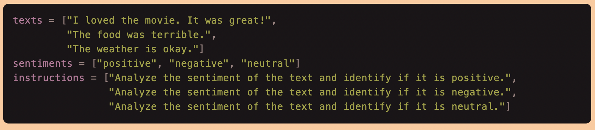
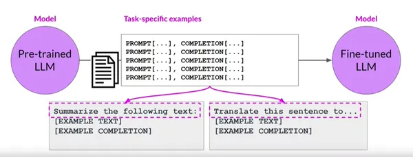

# FLAN-T5: Detailed Notes

**Full Name:** Instruction fine-tuned T5

**Type:** Encoder-decoder, sequence-to-sequence large language model (LLM)

**Developer:** Google AI

**Release:** Late 2022

## Key Features:

- **Open-source and commercially usable:** Freely available for research and development, and can be used for commercial applications with appropriate licensing.
  
- **Fine-tuned on a massive dataset:** Trained on a vast dataset of text and code, enabling it to perform various tasks like:
  - Text summarization: Condensing large amounts of text into concise summaries.
  - Text classification: Categorizing text data into predefined classes (e.g., spam or non-spam, positive or negative sentiment).
  - Code generation: Automatically generating code based on instructions or examples.

- **Multiple sizes available:** Offered in different sizes (base, large, etc.) catering to various computational needs and performance requirements.

## Potential Applications:

- **Information processing and summarization:** Summarizing long emails, documents, or meeting transcripts for easier comprehension.
  
- **Content creation and editing:** Assisting with tasks like writing different creative text formats, translating languages, and generating different creative text formats of text content.
  
- **Software development:** Helping developers by automatically generating code snippets or completing specific coding tasks.
  
- **Customer service chatbots:** Responding to customer inquiries and requests in a more informative and comprehensive way.

## Additional Notes:

- FLAN-T5 builds upon the earlier T5 model, offering better performance on various tasks due to fine-tuning on a specific dataset.
  
- It is crucial to be aware of potential biases inherent in large language models like FLAN-T5 and implement proper safeguards to mitigate them.
  
- Careful management and monitoring are necessary to ensure FLAN-T5 generates appropriate and unbiased outputs.

This information provides a more detailed understanding of FLAN-T5's capabilities and potential applications. Remember, it's equally important to be mindful of the ethical considerations surrounding large language models like FLAN-T5.

# Instruction Fine-Tuning: Customizing Pre-trained Large Language Models (LLMs)

Instruction fine-tuning is a technique used to customize pre-trained large language models (LLMs) to perform specific tasks based on explicit instructions or demonstrations. Unlike traditional fine-tuning, which involves training a model on task-specific data, instruction fine-tuning provides higher-level guidance to the model to shape its behavior according to predefined instructions.

## Process Breakdown:

1. **Pre-trained LLM:** The process begins with a pre-trained large language model (LLM), such as GPT (Generative Pre-trained Transformer) or T5 (Text-to-Text Transfer Transformer), which has been trained on a vast corpus of text data.

2. **Fine-tuned LLM:** Instead of directly fine-tuning the LLM on task-specific data, instruction fine-tuning involves providing explicit instructions or demonstrations to guide the model's behavior. These instructions can take various forms, such as textual prompts, examples of desired outputs, or specific constraints on the model's responses.

3. **Specifying Desired Outputs:** Developers specify the desired outputs or behaviors they want the fine-tuned model to exhibit based on the given instructions. This can include generating specific types of text, adhering to certain formatting rules, or producing responses that meet predefined criteria.

4. **Encouraging Certain Behaviors:** The instructions provided during fine-tuning serve to encourage certain behaviors or patterns in the model's outputs. By explicitly guiding the model's learning process, developers can shape its responses to better align with their intended goals.

5. **Achieving Better Control:** Instruction fine-tuning offers developers greater control over the model's responses compared to traditional fine-tuning methods. By providing explicit instructions or demonstrations, developers can influence the model's behavior in specific ways and achieve more precise outcomes.

Overall, instruction fine-tuning allows developers to customize pre-trained LLMs to perform specific tasks by providing explicit guidance and instructions. This approach enhances the model's ability to produce desired outputs and enables developers to achieve better control over its behavior.

For example :

# Key Differences Between Instruction Fine-Tuning and Standard Fine-Tuning

Here are the critical differences between instruction fine-tuning and standard fine-tuning:

1. **Data Requirements:**
   - Standard fine-tuning relies on a significant amount of labeled data for the specific task.
   - Instruction fine-tuning benefits from the guidance provided by explicit instructions, making it more adaptable with limited labeled data.

2. **Control and Precision:**
   - Instruction fine-tuning allows developers to specify desired outputs, encourage certain behaviors, or achieve better control over the model’s responses.
   - Standard fine-tuning may not offer this level of control.

3. **Learning from Instructions:**
   - Instruction fine-tuning requires an additional step of incorporating instructions into the model’s architecture, which standard fine-tuning does not.

Standard fine-tuning involves training a model on a labeled dataset, honing its abilities to perform specific tasks effectively. However, when it comes to fine-tuning large language models like GPT-3.5, if we want to provide explicit instructions to guide the model’s behavior, instruction fine-tuning comes into play. This approach offers unparalleled control and adaptability, allowing us to tailor the model’s responses to meet specific criteria or address nuanced requirements.

# Introducing Catastrophic Forgetting: A Perilous Challenge

As we navigate the vast realm of fine-tuning large language models, we inevitably face the daunting challenge of catastrophic forgetting. This phenomenon arises when the model undergoes fine-tuning for a new task, causing it to inadvertently erase or ‘forget’ the valuable knowledge acquired during pre-training. In this intricate process, the model risks losing its grasp on the broader language structure, concentrating its focus solely on the intricacies of the new task at hand.

Imagine our language model as a ship’s cargo hold filled with various knowledge containers, each representing different linguistic nuances. During pre-training, these containers are carefully filled with language understanding. The ship’s crew rearranges the containers when we approach a new task and begin fine-tuning. They empty some to make space for new task-specific knowledge. Unfortunately, some original knowledge is lost, leading to catastrophic forgetting.

# Mitigating Catastrophic Forgetting: Safeguarding Knowledge

To navigate the waters of catastrophic forgetting, we need strategies to safeguard the valuable knowledge captured during pre-training. There are two possible approaches:

## Multi-task Finetuning: Progressive Learning

- **Progressive Learning:**
  Here we gradually introduce the new task to the model. Initially, the model focuses on pre-training knowledge and slowly incorporates the new task data, minimizing the risk of catastrophic forgetting.

## Multitask Instruction Fine-tuning: A Revolutionary Approach

Multitask instruction fine-tuning introduces a revolutionary approach to refining large language models. Embracing a new paradigm, this method involves concurrently training language models on multiple tasks. Instead of the traditional approach of fine-tuning the model for one task at a time, multitask instruction fine-tuning takes a more holistic approach. It entails providing explicit instructions for each task, thereby guiding the model’s behavior throughout the fine-tuning process. This innovative technique not only enhances efficiency but also allows for a more seamless integration of diverse tasks, showcasing the adaptability and versatility of fine-tuning large language models.

### Benefits of Multitask Instruction Fine-Tuning

- **Knowledge Transfer:**
  The model gains insights and knowledge from different domains by training on multiple tasks, enhancing its overall language understanding.
  
- **Shared Representations:**
  Multitask instruction fine-tuning allows the model to share representations across tasks. This sharing of knowledge improves the model’s generalization capabilities.
  
- **Efficiency:**
  Training on multiple tasks concurrently reduces the computational cost and time compared to fine-tuning each task individually.
