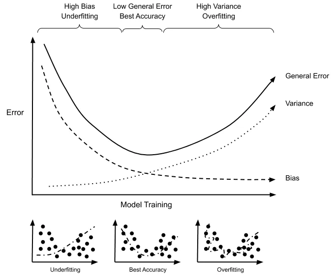

## What is Machine learning ? 

- Machine learning is a subset of artificial intelligence that enables computers to learn from data.
- It involves building models that can identify patterns and make predictions without being explicitly programmed.
- There are three main types: supervised learning, unsupervised learning, and reinforcement learning.
- Supervised learning uses labeled data, unsupervised learning uses unlabeled data, and reinforcement learning involves interaction with an environment.
- Machine learning is used in various applications Classification and Regression 
- Classification involves predicting a categorical label or class for a given input.Examples include classifying emails as spam or not spam, identifying whether an image contains a cat or a dog, or predicting customer churn (e.g., stay or leave).
- Regression, on the other hand, involves predicting a continuous numerical value.Examples include predicting house prices based on features like square footage, number of bedrooms, and location, forecasting stock prices, or estimating the temperature based on weather data.


## Supervised Learning

- In supervised learning, the model learns from labeled data, where each input data point is associated with a corresponding target label or output.
- The goal is to learn a mapping or relationship between the input features and the target labels, such as predicting a label for new, unseen data.
- Examples include classification (predicting discrete labels) and regression (predicting continuous values).
- Supervised learning requires a large amount of labeled data for training.


## Unsupervised Learning

- In unsupervised learning, the model learns patterns and structures from unlabeled data without explicit supervision.
- The goal is to discover hidden patterns or representations within the data, such as clustering similar data points together or reducing the dimensionality of the data.
- Examples include clustering (grouping similar data points), dimensionality reduction (reducing the number of input features), and density estimation (estimating the probability density function of the data).
- Unsupervised learning is useful for exploratory data analysis and understanding the underlying structure of the data.


## Semi-Supervised Learning

- Semi-supervised learning lies between supervised and unsupervised learning and utilizes both labeled and unlabeled data during training.
- The model learns from a small amount of labeled data along with a larger amount of unlabeled data.
- The goal is to improve the performance of supervised learning models by leveraging the additional unlabeled data, which may be more readily available.
- Semi-supervised learning methods often involve combining supervised and unsupervised learning techniques, such as self-training or co-training.


## Self-Supervised Learning

- In self-supervised learning, the model learns from the inherent structure of the input data itself, without relying on external labels.
- The model is trained on pretext tasks where the labels are generated from the input data, such as predicting missing parts of the input or solving puzzles.
- The learned representations can then be used for downstream tasks, similar to supervised learning.
- Self-supervised learning is advantageous when labeled data is scarce or expensive to obtain, as it allows the model to learn from large amounts of unlabeled data.


A self-supervised learning model is a type of machine learning model that learns representations from unlabeled data without explicit supervision. Instead of relying on labeled data, which is typical in supervised learning, self-supervised learning models generate labels from the input data itself.

Key characteristics of self-supervised learning models include:

- Unlabeled Data: These models are trained on large amounts of unlabeled data, where the input data itself serves as the source for generating labels or targets for training.
- Pretext Tasks: Self-supervised learning models are trained on pretext tasks, where the model predicts certain properties or transformations of the input data. These tasks are designed to encourage the model to learn meaningful representations of the data.
- Representation Learning: By learning to predict these pretext tasks, the model implicitly learns to extract useful features or representations of the data, which can then be used for downstream tasks.
- Transfer Learning: The learned representations from self-supervised learning can be transferred and fine-tuned for various downstream tasks, such as classification, regression, or clustering, often leading to improved performance, especially in scenarios with limited labeled data.

Self-supervised learning has gained popularity due to its ability to leverage large amounts of unlabeled data, which is often more readily available than labeled data. It has been successful in various domains, including natural language processing, computer vision, and speech recognition, among others.




# 1. Decision Trees 

Resource - https://www.analyticsvidhya.com/blog/2021/08/decision-tree-algorithm/


A decision tree - https://www.youtube.com/watch?v=JcI5E2Ng6r4&ab_channel=IntuitiveMachineLearning


A decision tree is a supervised machine learning algorithm for that can be used for both classification and regression tasks.Decision tree algorithm is a tree-like structured classifier preferably used to solve classification and regression problems.When a decision tree classifies the values into separate categories it is called classification tree. When it predicts continuous values/numerical values it is called regression tree.

It consists of nodes divided into three categories:

- **Root Node:** The initial node at the beginning of a decision tree, where the entire population or dataset starts dividing based on various features or conditions.

- **Decision Nodes:** Nodes resulting from the splitting of root nodes are known as decision nodes. These nodes represent intermediate decisions or conditions within the tree. Each decision node represents the possible solution to the problems.

- **Leaf Nodes:** Nodes where further splitting is not possible, often indicating the final classification or outcome. Leaf nodes are also referred to as terminal nodes. It is the actual output of the class label. There is no further classification of leaf node.

It goes from root node to leaf node. But it becomes quite complicated to select the best attribute for the root node & the sub nodes. We use election techniques to solve the problem. The values are sorted and the value having a higher value is taken at the root node.

The few attribute election techniques are:

- **Entropy** - Which is the measure of randomness in the information being processed.
- **Information Gain** - It shows the difference between the entropy of the root node and the weighted average entropy of the decision & leaf nodes.
- **Ginni Index** - measure of the purity and impurity while creating a decision tree.


1. **Root Node**: The initial node at the beginning of a decision tree, where the entire population or dataset starts dividing based on various features or conditions.

2. **Decision Nodes**: Nodes resulting from the splitting of root nodes are known as decision nodes. These nodes represent intermediate decisions or conditions within the tree.

3. **Leaf Nodes**: Nodes where further splitting is not possible, often indicating the final classification or outcome. Leaf nodes are also referred to as terminal nodes.

4. **Sub-Tree**: Similar to a subsection of a graph being called a sub-graph, a sub-section of a decision tree is referred to as a sub-tree. It represents a specific portion of the decision tree.

5. **Pruning**: The process of removing or cutting down specific nodes in a decision tree to prevent overfitting and simplify the model.

6. **Branch / Sub-Tree**: A subsection of the entire decision tree is referred to as a branch or sub-tree. It represents a specific path of decisions and outcomes within the tree.

7. **Parent and Child Node**: In a decision tree, a node that is divided into sub-nodes is known as a parent node, and the sub-nodes emerging from it are referred to as child nodes. The parent node represents a decision or condition, while the child nodes represent the potential outcomes or further decisions based on that condition.

### Learning Process:
The learning process of a decision tree involves finding the optimal splits for partitioning the data at each node. This is typically done using a criterion such as Gini impurity or information gain for classification tasks, or mean squared error for regression tasks.

* Gini Impurity: Measures the probability of incorrectly classifying a randomly chosen element if it were randomly labeled according to the class distribution in the node.

* Information Gain: Measures the reduction in entropy or uncertainty achieved by splitting the data based on a specific feature

An attribute with a low Gini index is preferred over the high Gini index.


### Advantages of Decision Trees

- **Relatively Easy to Interpret:** Decision trees provide a straightforward and intuitive representation of decision-making processes, making them easy to understand for non-experts.

- **Robust to Outliers:** Decision trees are robust to outliers in the data, as they partition the feature space based on splitting criteria rather than relying on the absolute values of data points.

- **Can Deal with Missing Values:** Decision trees can handle missing values in the dataset by using surrogate splits, which allow them to still make decisions even when certain feature values are missing.

- **Non-Linear:** Decision trees are capable of capturing non-linear relationships between features and the target variable, allowing them to model complex decision boundaries.

- **Non-Parametric:** Decision trees do not make assumptions about the underlying distribution of the data, making them flexible and suitable for a wide range of data distributions.

- **Combining Features to Make Predictions:** Decision trees can combine multiple features to make predictions, allowing them to capture interactions between different features in the data.

- **Can Deal with Categorical Values:** Decision trees naturally handle categorical values without the need for one-hot encoding or other preprocessing techniques.

- **Minimal Data Preparation:** Decision trees require minimal data preprocessing compared to some other machine learning algorithms, as they can handle mixed data types and do not require scaling or normalization of features.

### Disadvantages of Decision Trees

- **Overfitting:** Decision trees are prone to overfitting, especially with deep trees and complex data, which can lead to poor generalization performance on unseen data.

- **Instability due to High Variance:** Small variations in the data can lead to different tree structures, making decision trees unstable.

- **Bias towards Features with Many Levels:** Features with many levels are favored in the construction of decision trees, which can lead to biased splits and potentially overlook important but less represented features.

- **Limited Expressiveness:** Decision trees may not capture complex relationships between features in the data, leading to suboptimal performance on tasks with intricate patterns.


### How it works with an Example? 

Suppose we have a dataset of animals with features like whether they have feathers, lay eggs, and can fly. We also have the target variable indicating whether the animal is a bird or not. Here's a small portion of our dataset:

| Feathers | Lay Eggs | Can Fly | Is Bird? |
|----------|----------|---------|----------|
| Yes      | Yes      | Yes     | Yes      |
| Yes      | Yes      | No      | No       |
| No       | Yes      | No      | No       |
| Yes      | No       | Yes     | Yes      |
| No       | Yes      | No      | No       |
| No       | No       | No      | No       |
| Yes      | Yes      | Yes     | Yes      |
| Yes      | Yes      | Yes     | Yes      |

We want to build a decision tree to predict whether an animal is a bird based on its features.

1. **Root Node**: We start by choosing the best feature to split the dataset at the root node. We use a metric like Information Gain to evaluate the effectiveness of each feature. Let's say we choose "Can Fly" as the root node because it has the highest Information Gain.

2. **Decision Nodes**: The "Can Fly" node splits the dataset into two branches: animals that can fly and animals that cannot. Each branch leads to a decision node.

3. **Leaf Nodes**: At the decision nodes, we continue splitting the dataset based on other features. For example, the branch with animals that can fly might further split based on whether they have feathers. This process continues until we reach leaf nodes where no further splitting is possible.

The decision tree might look like this:

```
        Can Fly?
       /         \
  Yes /           \ No
     /             \
 Feathers?         No
  /    \
 Yes   No
  |     |
 Bird   Not Bird
```
Now, if we want to classify a new animal, we start at the root node and follow the branches based on its features. For example, if the animal has feathers, does not lay eggs, and cannot fly, we would classify it as "Not Bird" based on the decision tree.

This is a simplified example, but it illustrates the basic concept of how decision trees work by recursively splitting the dataset based on features to make predictions.


# 2. Random Forest

Random Forest is a popular ensemble learning method used in machine learning for both classification and regression tasks. It is an extension of decision trees and operates by constructing a multitude of decision trees during the training phase and outputting the class that is the mode of the classes (classification) or mean prediction (regression) of the individual trees.


### How Random Forest Works:

1. **Random Sampling with Replacement (Bootstrap Aggregating or Bagging):**
   - Random Forest builds multiple decision trees by randomly sampling the training data with replacement. Each decision tree is trained on a different subset of the data.

2. **Random Feature Selection:**
   - At each node of the decision tree, a random subset of features is considered for splitting. This introduces randomness and decorrelation between the individual trees.

3. **Tree Building:**
   - Each decision tree in the Random Forest is constructed using a subset of the training data and a subset of features at each node.
   - The decision trees are grown to their maximum depth or until a minimum number of samples per leaf node is reached.

4. **Voting (Classification) or Averaging (Regression):**
   - For classification tasks, the class that receives the most votes from the individual trees is selected as the predicted class.
   - For regression tasks, the average prediction from all the individual trees is taken as the final prediction.

### Advantages of Random Forest:

1. **High Accuracy:**
   - Random Forest generally provides higher accuracy compared to single decision trees, especially for complex datasets.

2. **Robustness to Overfitting:**
   - By averaging multiple decision trees, Random Forest is less prone to overfitting than individual decision trees.

3. **Implicit Feature Selection:**
   - Random Forest naturally performs feature selection by evaluating the importance of different features based on their contribution to the performance of the trees.

4. **Handling Missing Values and Outliers:**
   - Random Forest can handle missing values and outliers in the dataset without requiring preprocessing.

5. **Scalability:**
   - Random Forest is parallelizable and can efficiently handle large datasets.

### Disadvantages of Random Forest:

1. **Lack of Interpretability:**
   - Random Forest models can be difficult to interpret compared to individual decision trees.

2. **Computationally Expensive:**
   - Training multiple decision trees and aggregating their predictions can be computationally expensive, especially for large datasets.

3. **Memory Consumption:**
   - Random Forest models can consume a significant amount of memory, particularly when dealing with a large number of trees or features.

4. **Less Effective on Noisy Data:**
   - Random Forest may not perform well on noisy data with a large number of irrelevant features, as it may include irrelevant features in the tree construction process.

# Difference between Decision trees & Random Forest ? 

| Decision trees                                             | Random Forest                                               |
|------------------------------------------------------------|-------------------------------------------------------------|
| Decision trees normally suffer from the problem of overfitting if it’s allowed to grow without any control. | Random forests are created from subsets of data, and the final output is based on average or majority ranking; hence the problem of overfitting is taken care of. |
| A single decision tree is faster in computation.           | It is comparatively slower.                                 |
| When a data set with features is taken as input by a decision tree, it will formulate some rules to make predictions. | Random forest randomly selects observations, builds a decision tree, and takes the average result. It doesn’t use any set of formulas. |


# 3. XGBoost

XGBoost, short for eXtreme Gradient Boosting, is an optimized and efficient implementation of the gradient boosting machine learning algorithm. It is widely used in machine learning competitions and real-world applications due to its high performance and scalability. XGBoost is designed to be highly efficient, flexible, and customizable, making it suitable for a wide range of tasks, including classification, regression, and ranking problems.


XGBoost (Extreme Gradient Boosting) is an ensemble learning method that utilizes the gradient boosting framework for supervised learning tasks, primarily regression and classification. It is an extension of the traditional gradient boosting algorithm with enhanced efficiency and performance.

Bootstrapping

- Bootstrapping is a resampling technique where multiple subsets of the original dataset are created by randomly sampling with replacement.
- In the context of XGBoost, bootstrapping is used during the training process to generate diverse subsets of the training data for each individual tree in the ensemble.
- Each subset, also known as a bootstrap sample, contains a random selection of data points from the original dataset, potentially including duplicates of certain observations due to sampling with replacement.

Aggregating

- Aggregating refers to the process of combining the predictions of multiple individual models (trees in the case of XGBoost) to make a final prediction.
- In XGBoost, each individual tree learns to predict the target variable based on a subset of the training data. These individual predictions are aggregated to produce the final ensemble prediction.
- Aggregating the predictions of multiple trees helps to improve the overall predictive performance of the model by reducing variance and enhancing generalization.

Bagging (Bootstrap Aggregating)

- Bagging is a machine learning ensemble technique that combines the concepts of bootstrapping and aggregating.
- In XGBoost, bagging is achieved through the use of multiple decision trees, each trained on a different bootstrap sample of the original dataset.
- Bagging helps to reduce overfitting by introducing diversity among the individual trees in the ensemble, thereby improving the model's ability to generalize to unseen data.
- By aggregating the predictions of multiple trees trained on different subsets of the data, bagging produces a more robust and accurate predictive model compared to a single decision tree.

In summary, XGBoost utilizes bootstrapping to generate diverse subsets of the training data, aggregates the predictions of multiple individual trees, and employs bagging to combine the concepts of bootstrapping and aggregating to improve the overall predictive performance of the model.


### Key Features of XGBoost:

1. **Gradient Boosting Framework:**
   - XGBoost builds a strong predictive model by combining multiple weak models (typically decision trees) in an additive manner using the gradient boosting framework.

2. **Regularization:**
   - XGBoost incorporates L1 (Lasso) and L2 (Ridge) regularization techniques to prevent overfitting and improve generalization performance.

3. **Tree Pruning:**
   - XGBoost uses advanced tree pruning algorithms to remove tree branches that do not contribute significantly to the overall model performance, reducing model complexity and improving efficiency.

4. **Cross-validation Support:**
   - XGBoost provides built-in support for cross-validation, allowing users to evaluate the model's performance and tune hyperparameters effectively.

5. **Parallel and Distributed Computing:**
   - XGBoost is designed for parallel and distributed computing, enabling efficient training on large datasets by utilizing multiple CPU cores or distributed computing frameworks like Apache Spark.

6. **Handling Missing Values:**
   - XGBoost automatically handles missing values in the dataset, eliminating the need for preprocessing steps such as imputation.

7. **Customizable Objective Functions and Evaluation Metrics:**
   - XGBoost allows users to define custom objective functions and evaluation metrics tailored to specific tasks, providing flexibility and adaptability to various machine learning problems.

8. **Feature Importance:**
   - XGBoost provides feature importance scores, indicating the relative importance of each feature in the model's predictions, aiding in feature selection and interpretation.

9. **Integration with Other Libraries:**
   - XGBoost can be seamlessly integrated with popular machine learning libraries and frameworks such as scikit-learn, Apache Spark, and TensorFlow.

### Advantages of XGBoost:

1. **High Performance:**
   - XGBoost is known for its high performance and efficiency, often outperforming other machine learning algorithms in terms of accuracy and speed.

2. **Robustness to Overfitting:**
   - XGBoost's regularization techniques and advanced pruning algorithms help prevent overfitting, leading to more robust and generalizable models.

3. **Flexibility and Customization:**
   - XGBoost provides a wide range of hyperparameters and customization options, allowing users to fine-tune the model for optimal performance in various scenarios.

4. **Interpretability:**
   - While XGBoost models may not be as interpretable as simpler models like linear regression, feature importance scores provided by XGBoost can aid in understanding the model's decision-making process.

### Disadvantages of XGBoost:

1. **Complexity:**
   - XGBoost's advanced features and customization options may lead to increased complexity, requiring users to have a deeper understanding of the algorithm and its hyperparameters.

2. **Computational Resources:**
   - Training XGBoost models with large datasets or complex configurations may require significant computational resources, including memory and processing power.

3. **Parameter Tuning:**
   - While XGBoost offers a wide range of hyperparameters for customization, tuning these parameters effectively may require experimentation and computational resources.

Overall, XGBoost is a powerful and versatile algorithm that excels in various machine learning tasks, particularly when dealing with structured/tabular data, and it is widely adopted in both research and industry settings.


# 4. Logistic Regression

Logistic Regression is a statistical method used for modeling the relationship between a binary dependent variable and one or more independent variables. Despite its name, logistic regression is actually a classification algorithm, commonly used for binary classification tasks, where the target variable has two possible outcomes (e.g., 0 or 1, true or false, yes or no).

### How Logistic Regression Works:

1. **Model Representation:**
   - In logistic regression, the dependent variable \( y \) is binary (0 or 1). The goal is to model the probability that \( y \) belongs to a particular class given the values of independent variables \( X \).

2. **Sigmoid Function:**
   - Logistic regression uses the sigmoid function (also known as the logistic function) to model the probability of the dependent variable belonging to the positive class:
   \[ P(y=1|X) = \frac{1}{1 + e^{-z}} \]
   where \( z \) is the linear combination of the independent variables and their corresponding coefficients: \( z = \beta_0 + \beta_1x_1 + \beta_2x_2 + ... + \beta_nx_n \).

3. **Probability Threshold:**
   - By default, logistic regression predicts the class with a probability threshold of 0.5. If the predicted probability is greater than or equal to 0.5, the model predicts class 1; otherwise, it predicts class 0.

4. **Training:**
   - Logistic regression is trained using an optimization algorithm such as gradient descent, which minimizes a cost function (e.g., cross-entropy loss) to find the optimal coefficients \( \beta \) that maximize the likelihood of the observed data.

5. **Prediction:**
   - Once trained, the logistic regression model can predict the probability of an observation belonging to the positive class (class 1) based on its input features. The predicted probability can then be converted into a binary prediction using the probability threshold.

### Advantages & disadvantages of Logistic Regression:

| Advantages of Logistic Regression                                    | Disadvantages of Logistic Regression                                 |
|----------------------------------------------------------------------|----------------------------------------------------------------------|
| Simple and Interpretable:                                           | Assumes Linearity:                                                  |
| Logistic regression is a simple and interpretable algorithm that provides insights into the relationship between independent variables and the probability of the target variable. | Logistic regression assumes a linear relationship between the independent variables and the log-odds of the dependent variable, which may not always hold true in practice. |
| Efficient:                                                          | Limited Complexity:                                                 |
| Logistic regression is computationally efficient and can handle large datasets with relatively low computational resources. | Logistic regression is a linear model and may not capture complex nonlinear relationships between independent and dependent variables. |
| Scalable:                                                           | Binary Classification Only:                                         |
| Logistic regression can be easily scaled to handle multi-class classification problems using techniques such as one-vs-rest or multinomial logistic regression. | Logistic regression is limited to binary classification tasks and may not be suitable for multi-class classification problems without modification. |
| Probabilistic Outputs:                                              | Sensitive to Outliers:                                               |
| Logistic regression provides probabilistic outputs, allowing for a probabilistic interpretation of predictions. | Logistic regression is sensitive to outliers in the dataset, which can influence the estimated coefficients and predictions. |


Overall, logistic regression is a widely used and effective algorithm for binary classification tasks, especially when interpretability and efficiency are important considerations. However, it may not be suitable for tasks with complex nonlinear relationships or multi-class classification problems.

# 5. Linear Regression
Linear regression is a supervised machine learning algorithm used for predicting continuous target variables based on one or more independent variables.

Linear regression is a statistical method used to model the relationship between a dependent variable and one or more independent variables.
It assumes a linear relationship between the independent variables and the dependent variable.

The general form of a linear regression model with one independent variable is \( y = mx + b \), where \( y \) is the dependent variable, \( x \) is the independent variable, \( m \) is the slope of the line, and \( b \) is the y-intercept.

The goal of linear regression is to find the best-fitting straight line (or hyperplane in the case of multiple independent variables) that minimizes the sum of the squared differences between the observed values of the dependent variable and the values predicted by the linear model.

The linear regression model estimates the values of the slope \( m \) and the y-intercept \( b \) based on the observed data points. This is often done using the method of least squares.

Linear regression is widely used in various fields such as economics, finance, engineering, and social sciences for tasks such as predicting house prices, analyzing the relationship between variables, and understanding the impact of independent variables on the dependent variable.

It is also the foundation for more complex regression techniques and machine learning algorithms.

Objective:
- Minimize the difference between actual and predicted values by finding the best-fitting line.

Output:
- Coefficients: Slope(s) and intercept(s) for each feature.
- Predictions: Estimated values for the target variable based on input features.

Output:

y=mx+b
m - slope/coefficients
b - intercept
Coefficients: Slope(s) and intercept(s) for each feature.
Predictions: Estimated values for the target variable based on input features.

Evaluation:
Metrics: Mean Squared Error (MSE), Root Mean Squared Error (RMSE), R-squared.
Assessing Fit: Plotting actual vs. predicted values, residual plots.

# what does coefficients tell us Linear regression output machine learning?
Coefficients in linear regression output indicate the strength and direction of the relationship between independent variables and the target variable.
They represent the change in the target variable for a one-unit change in the corresponding independent variable, holding other variables constant.
Positive coefficients suggest a positive correlation, meaning an increase in the independent variable leads to an increase in the target variable.
Negative coefficients suggest a negative correlation, meaning an increase in the independent variable leads to a decrease in the target variable.
Coefficients can be interpreted to understand the relative importance of different features in predicting the target variable.
They are essential for making predictions using the linear regression model.

# Difference between Linear Regression & Logistic regression ? 

| Aspect                  | Linear Regression                                | Logistic Regression                              |
|-------------------------|--------------------------------------------------|---------------------------------------------------|
| Nature of Dependent Variable | Continuous (numeric)                           | Categorical (binary)                            |
| Output Function         | Predicts values on a continuous scale            | Predicts probabilities constrained between 0 and 1 |
| Model Assumptions       | Assumes linear relationship between independent variables and dependent variable, normally distributed residuals | Does not assume linear relationship, models log-odds of dependent variable as linear combination of independent variables |
| Best Fit                | Straight line                                    | Curve (sigmoid function)                         |
| Use Cases               | Predicting continuous outcomes such as house prices, temperature, stock prices | Predicting probabilities of binary events, classification tasks such as spam detection, disease diagnosis |


# 6. Support Vector Machine (SVM)

Support Vector Machine (SVM) is a supervised machine learning algorithm used for classification and regression tasks. It is particularly effective for classification tasks in high-dimensional spaces and cases where the number of dimensions is greater than the number of samples.


### How SVM Works:

1. **Margin Maximization:**
   - SVM aims to find the hyperplane that best separates the classes in the feature space while maximizing the margin between the classes. The hyperplane is the decision boundary that separates the data points belonging to different classes.

2. **Support Vectors:**
   - Support vectors are the data points closest to the hyperplane and are crucial for defining the decision boundary. These points determine the margin and the orientation of the hyperplane.

3. **Kernel Trick:**
   - SVM can efficiently handle non-linear decision boundaries in the feature space by using the kernel trick. This involves mapping the original input space into a higher-dimensional space where the classes are linearly separable.

4. **Soft Margin SVM:**
   - In cases where the data is not perfectly separable, SVM allows for the introduction of a penalty term (C parameter) to control the trade-off between maximizing the margin and minimizing the classification error.

### Advantages & disadvantage of SVM:

| Advantages of SVM                                                | Disadvantages of SVM                                                                 |
|------------------------------------------------------------------|--------------------------------------------------------------------------------------|
| Effective in High-Dimensional Spaces:                            | Sensitive to Choice of Kernel and Parameters:                                         |
| SVM performs well in high-dimensional spaces, making it suitable for tasks with a large number of features, such as text classification and image recognition. | The performance of SVM is sensitive to the choice of kernel function and tuning parameters, such as the regularization parameter (C) and kernel parameters. |
| Robust to Overfitting:                                          | Computational Complexity:                                                             |
| SVM is less prone to overfitting, especially in high-dimensional spaces, due to the margin maximization objective, which encourages a simpler decision boundary. | Training an SVM model can be computationally expensive, especially for large datasets or when using complex kernel functions. |
| Versatile Kernel Options:                                       | Limited Interpretability:                                                             |
| SVM supports various kernel functions (e.g., linear, polynomial, radial basis function) to handle different types of data and decision boundaries. | SVM models are not as interpretable as some other machine learning algorithms, such as decision trees, making it challenging to understand the underlying decision process. |
| Memory Efficient:                                               | Difficulty with Large Datasets:                                                        |
| SVM uses a subset of training points (support vectors) in the decision function, making it memory efficient, especially for large datasets. | SVM may not scale well to extremely large datasets due to its computational complexity and memory requirements. |


Overall, SVM is a powerful and versatile algorithm that performs well in high-dimensional spaces and is effective for classification tasks with complex decision boundaries. However, it requires careful selection of parameters and may not be suitable for tasks with extremely large datasets.


# 7. LightGBM 

LightGBM is a gradient boosting framework developed by Microsoft that is widely used for supervised learning tasks such as classification, regression, and ranking. It is known for its high performance, efficiency, and scalability, making it suitable for large-scale and high-dimensional datasets.

### Key Features of LightGBM:

1. **Gradient Boosting Framework:**
   - LightGBM is based on the gradient boosting framework, which builds an ensemble of weak learners (decision trees) in a sequential manner, where each new tree corrects the errors made by the previous ones.

2. **Leaf-wise Tree Growth:**
   - LightGBM grows trees leaf-wise instead of level-wise, which can lead to faster convergence and lower memory usage.

3. **Gradient-based One-Side Sampling (GOSS):**
   - LightGBM uses Gradient-based One-Side Sampling (GOSS) to select a small percentage of data instances with larger gradients for constructing trees, reducing overfitting while maintaining accuracy.

4. **Exclusive Feature Bundling (EFB):**
   - LightGBM performs Exclusive Feature Bundling (EFB) to group categorical features with many levels into fewer groups, reducing the number of split candidates and improving efficiency.

5. **Histogram-based Splitting:**
   - LightGBM uses histogram-based algorithms to find the best splits for continuous features, which speeds up the training process by avoiding sorting the feature values.

6. **GPU Support:**
   - LightGBM supports training on GPUs, leveraging their parallel processing capabilities to accelerate the training process significantly.

7. **Cross-validation Support:**
   - LightGBM provides built-in support for cross-validation, allowing users to evaluate model performance and tune hyperparameters effectively.

8. **Scalability:**
   - LightGBM is highly scalable and can handle large-scale datasets with millions of samples and features, making it suitable for big data applications.
  
### Advantage & disadvantage of LightGBM

| Advantages of LightGBM                                         | Disadvantages of LightGBM                                              |
|---------------------------------------------------------------|----------------------------------------------------------------------|
| **High Performance:**                                         | **Black Box Model:**                                                 |
| LightGBM is known for its high performance and efficiency, often outperforming other gradient boosting frameworks in terms of speed and accuracy. | Like other gradient boosting frameworks, LightGBM is a black box model, making it challenging to interpret the underlying decision process compared to simpler models like linear regression. |
| **Efficient Memory Usage:**                                  | **Sensitive to Overfitting:**                                         |
| LightGBM consumes less memory compared to other gradient boosting frameworks, making it suitable for training models on machines with limited memory resources. | LightGBM models can be sensitive to overfitting, especially when training on small datasets or using complex models with many trees and deep trees. |
| **Scalability:**                                              | **Complex Parameter Tuning:**                                         |
| LightGBM can handle large-scale datasets efficiently, making it suitable for big data applications and distributed computing environments. | While LightGBM provides a wide range of hyperparameters for customization, tuning these parameters effectively may require experimentation and computational resources. |
| **Customizable and Flexible:**                                |                                                                      |
| LightGBM provides a wide range of hyperparameters and customization options, allowing users to fine-tune the model for optimal performance in various scenarios. |                                                                      |


Overall, LightGBM is a powerful and efficient gradient boosting framework that excels in terms of performance, efficiency, and scalability, making it a popular choice for various machine learning tasks, particularly in big data and high-dimensional settings.


# 8. What is supervised and unsupervised machine learning algorithms

Supervised learning algorithms
Supervised machine learning is a type of ML where the model learns from labeled data, with input-output pairs provided.

* Key Components
Training Data: Labeled dataset used to train the model.
Model: Algorithm or framework used to learn patterns from data.
Labels: Known outputs corresponding to input data points.
Loss Function: Measures the difference between predicted and actual outputs.
Optimization Algorithm: Adjusts model parameters to minimize the loss function.

Types of Supervised Learning

Regression: Predicts continuous outcomes.
Classification: Predicts discrete outcomes or classes.

Popular Algorithms:
Regression: Linear Regression, Decision Trees, Random Forest, Support Vector Machines (SVM), Gradient Boosting.
Classification: Logistic Regression, Decision Trees, Random Forest, Support Vector Machines (SVM), Neural Networks.

Challenges :
Overfitting: Model memorizes the training data and performs poorly on unseen data.
Underfitting: Model is too simple to capture the underlying patterns in the data.
Bias-Variance Tradeoff: Balancing the model's ability to capture complex patterns without overfitting.

Applications:
Predictive Analytics: Forecasting sales, stock prices, weather, etc.
Image Recognition: Identifying objects, faces, and patterns in images.
Natural Language Processing (NLP): Text classification, sentiment analysis, language translation.
Healthcare: Predicting disease diagnosis, patient outcomes, drug discovery.

Future Trends:
Automated Machine Learning (AutoML): Streamlining the ML workflow by automating model selection, hyperparameter tuning, and feature engineering.
Explainable AI (XAI): Making AI models more transparent and interpretable to improve trust and accountability.
Federated Learning: Training ML models across decentralized devices to preserve data privacy.
Continual Learning: Enabling models to learn from new data over time without forgetting previous knowledge.


Unsupervised Learning:

Unsupervised learning, also known as unsupervised machine learning, uses machine learning (ML) algorithms to analyze and cluster unlabeled data sets. These algorithms discover hidden patterns or data groupings without the need for human intervention.


# 9. what does coefficients tell us Linear regression output machine learning ?

* Coefficients in linear regression output indicate the strength and direction of the relationship between independent variables and the target variable.
* They represent the change in the target variable for a one-unit change in the corresponding independent variable, holding other variables constant.
* Positive coefficients suggest a positive correlation, meaning an increase in the independent variable leads to an increase in the target variable.
* Negative coefficients suggest a negative correlation, meaning an increase in the independent variable leads to a decrease in the target variable.
* Coefficients can be interpreted to understand the relative importance of different features in predicting the target variable.
* They are essential for making predictions using the linear regression model.


# 10. what does coefficients tell us neural network output machine learning

* Coefficients in a neural network output indicate the importance or weight assigned to each feature in making predictions.
* They represent the strength of the connection between neurons in different layers of the network.
Coefficients are adjusted during the training process to minimize prediction error and improve model performance.
* Larger coefficients imply greater influence of a feature on the output, while smaller coefficients suggest less impact.
* Coefficients help interpret how changes in input features affect the model's predictions.
* In linear models, coefficients directly correspond to the contribution of each feature to the output, while in neural networks, they represent complex interactions within the network's architecture


