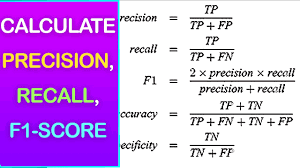
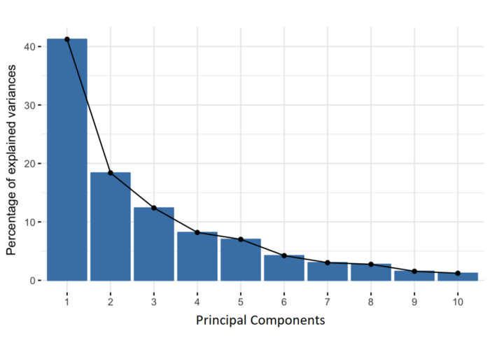

## What is Machine learning ? 

- Machine learning is a subset of artificial intelligence that enables computers to learn from data.
- It involves building models that can identify patterns and make predictions without being explicitly programmed.
- There are three main types: supervised learning, unsupervised learning, and reinforcement learning.
- Supervised learning uses labeled data, unsupervised learning uses unlabeled data, and reinforcement learning involves interaction with an environment.
- Machine learning is used in various applications Classification and Regression 
- Classification involves predicting a categorical label or class for a given input.Examples include classifying emails as spam or not spam, identifying whether an image contains a cat or a dog, or predicting customer churn (e.g., stay or leave).
- Regression, on the other hand, involves predicting a continuous numerical value.Examples include predicting house prices based on features like square footage, number of bedrooms, and location, forecasting stock prices, or estimating the temperature based on weather data.

## Supervised Learning

- In supervised learning, the model learns from labeled data, where each input data point is associated with a corresponding target label or output.
- The goal is to learn a mapping or relationship between the input features and the target labels, such as predicting a label for new, unseen data.
- Examples include classification (predicting discrete labels) and regression (predicting continuous values).
- Supervised learning requires a large amount of labeled data for training.

## Unsupervised Learning

- In unsupervised learning, the model learns patterns and structures from unlabeled data without explicit supervision.
- The goal is to discover hidden patterns or representations within the data, such as clustering similar data points together or reducing the dimensionality of the data.
- Examples include clustering (grouping similar data points), dimensionality reduction (reducing the number of input features), and density estimation (estimating the probability density function of the data).
- Unsupervised learning is useful for exploratory data analysis and understanding the underlying structure of the data.

## Reinforcement Learning 

Reinforcement learning (RL) is a type of machine learning where an agent learns to make decisions by performing certain actions and receiving feedback from those actions. The feedback, typically in the form of rewards or punishments, helps the agent to learn which actions yield the most beneficial outcomes over time. This learning paradigm is inspired by behavioral psychology, where learning is driven by interactions with the environment.

Here are the key components and concepts in reinforcement learning:

* Agent: The learner or decision-maker that interacts with the environment.
* Environment: Everything outside the agent that the agent interacts with. The environment responds to the actions taken by the agent.
* State: A specific situation or configuration in which the agent finds itself in the environment.
* Action: Any move or decision the agent makes that affects the state.
* Reward: Immediate feedback received from the environment after an action is taken. It indicates the success or failure of the action.
* Policy: A strategy used by the agent to determine the next action based on the current state.
* Value Function: A function that estimates the expected long-term return (cumulative reward) of being in a state and following a particular policy.
* Q-Function (Action-Value Function): A function that estimates the expected return of taking a specific action in a specific state and then following a particular policy.
The process of reinforcement learning typically follows these steps:

* Initialize: The agent starts with some initial policy and initial estimates of the value functions.
* Observe State: The agent observes the current state of the environment.
* Select Action: Based on the current state and policy, the agent selects an action.
* Receive Reward and New State: After performing the action, the agent receives a reward from the environment and observes the new state.
* Update Policy and Value Functions: Using the received reward and the new state, the agent updates its policy and value functions to improve future decision-making.

Types of Reinforcement Learning Algorithms
* Model-Free vs. Model-Based:

- Model-Free algorithms (e.g., Q-learning, SARSA) do not require a model of the environment and learn directly from interactions.- 
- Model-Based algorithms (e.g., Dyna-Q) build a model of the environment and use it to simulate experiences.

* On-Policy vs. Off-Policy:
- On-Policy methods (e.g., SARSA) learn the value of the policy being carried out by the agent, including the exploration strategy.
- Off-Policy methods (e.g., Q-learning) learn the value of the optimal policy independently of the agent's current actions.
Value-Based vs. Policy-Based:

- Value-Based methods (e.g., Q-learning) focus on estimating value functions.
- Policy-Based methods (e.g., REINFORCE) focus directly on optimizing the policy without relying on value functions.
- Actor-Critic methods combine both approaches by having an actor (policy) and a critic (value function) that work together.
Applications

* Reinforcement learning has been successfully applied in various fields, including:

- Gaming: Training agents to play games like chess, Go, and video games.
- Robotics: Teaching robots to perform tasks and navigate environments.
- Finance: Optimizing trading strategies and portfolio management.
- Healthcare: Personalizing treatment plans and optimizing medical decision-making.
- Autonomous Vehicles: Developing self-driving cars that can navigate complex environments.
- Reinforcement learning continues to be an active area of research with ongoing advancements in algorithms, theoretical foundations, and real-world applications.

## Semi-Supervised Learning

- Semi-supervised learning lies between supervised and unsupervised learning and utilizes both labeled and unlabeled data during training.
- The model learns from a small amount of labeled data along with a larger amount of unlabeled data.
- The goal is to improve the performance of supervised learning models by leveraging the additional unlabeled data, which may be more readily available.
- Semi-supervised learning methods often involve combining supervised and unsupervised learning techniques, such as self-training or co-training.

## Self-Supervised Learning

- In self-supervised learning, the model learns from the inherent structure of the input data itself, without relying on external labels.
- The model is trained on pretext tasks where the labels are generated from the input data, such as predicting missing parts of the input or solving puzzles.
- The learned representations can then be used for downstream tasks, similar to supervised learning.
- Self-supervised learning is advantageous when labeled data is scarce or expensive to obtain, as it allows the model to learn from large amounts of unlabeled data.

A self-supervised learning model is a type of machine learning model that learns representations from unlabeled data without explicit supervision. Instead of relying on labeled data, which is typical in supervised learning, self-supervised learning models generate labels from the input data itself.

Key characteristics of self-supervised learning models include:

- Unlabeled Data: These models are trained on large amounts of unlabeled data, where the input data itself serves as the source for generating labels or targets for training.
- Pretext Tasks: Self-supervised learning models are trained on pretext tasks, where the model predicts certain properties or transformations of the input data. These tasks are designed to encourage the model to learn meaningful representations of the data.
- Representation Learning: By learning to predict these pretext tasks, the model implicitly learns to extract useful features or representations of the data, which can then be used for downstream tasks.
- Transfer Learning: The learned representations from self-supervised learning can be transferred and fine-tuned for various downstream tasks, such as classification, regression, or clustering, often leading to improved performance, especially in scenarios with limited labeled data.

Self-supervised learning has gained popularity due to its ability to leverage large amounts of unlabeled data, which is often more readily available than labeled data. It has been successful in various domains, including natural language processing, computer vision, and speech recognition, among others.

## Underfitting and Overfitting

Underfitting and overfitting are two common problems in machine learning that relate to the model's performance on training data versus unseen data. They occur when a model is either too simple or too complex, respectively.

## Underfitting

**Definition:** Underfitting happens when a model is too simple to capture the underlying structure of the data. It performs poorly on both the training set and the test set.

### Causes:
- **Too Simple Model:** Using a linear model to fit non-linear data.
- **Insufficient Features:** Not including enough features that capture the relevant information.
- **High Bias:** The model makes strong assumptions about the data, leading to high bias and low variance.

### Symptoms:
- High training error.
- High test error.
- Poor model performance on both known and new data.

### Solution:
- Use a more complex model (e.g., adding polynomial features).
- Include more relevant features.
- Reduce regularization (if applicable).

## Overfitting

**Definition:** Overfitting occurs when a model is too complex and learns not only the underlying structure but also the noise in the training data. It performs well on the training set but poorly on the test set.

### Causes:
- **Too Complex Model:** Using a very flexible model with many parameters.
- **Too Many Features:** Including too many irrelevant features.
- **Low Bias:** The model makes fewer assumptions about the data, leading to low bias and high variance.

### Symptoms:
- Low training error.
- High test error.
- Poor generalization to new data.

### Solution:
- Use a simpler model.
- Apply regularization techniques (e.g., L1 or L2 regularization).
- Use cross-validation to tune hyperparameters.
- Reduce the number of features by feature selection or dimensionality reduction.

## Visual Representation

### Underfitting:
Imagine trying to fit a straight line (linear model) through a set of points that form a quadratic pattern. The line will not capture the curve, resulting in poor fit and high errors.

### Overfitting:
Imagine fitting a high-degree polynomial through the same set of quadratic points. The polynomial will likely pass through all the points, including any noise, resulting in a model that performs perfectly on training data but poorly on unseen data.

## Bias-Variance Tradeoff

Both underfitting and overfitting can be understood in the context of the bias-variance tradeoff:
- **High Bias (Underfitting):** The model is too simple and does not capture the underlying patterns in the data.
- **High Variance (Overfitting):** The model is too complex and captures noise as well as the underlying patterns.

The goal is to find a balance where the model has low bias and low variance, achieving good performance on both the training and test sets.

# 1. Decision Trees 

Resource - https://www.analyticsvidhya.com/blog/2021/08/decision-tree-algorithm/

A decision tree - https://www.youtube.com/watch?v=JcI5E2Ng6r4&ab_channel=IntuitiveMachineLearning

A decision tree is a supervised machine learning algorithm for that can be used for both classification and regression tasks.Decision tree algorithm is a tree-like structured classifier preferably used to solve classification and regression problems.When a decision tree classifies the values into separate categories it is called classification tree. When it predicts continuous values/numerical values it is called regression tree.

Components of a Decision Tree

* **Root Node**: Represents the entire dataset, and this node is split into two or more homogeneous sets.
* **Decision Nodes**: These are nodes where the data is split based on a feature.
* **Leaf/Terminal Nodes**: These nodes represent the outcome or final decision.
* **Branches**: Connect nodes and represent the decision rules or outcomes from the decision nodes.

How Decision Trees Work
1. **Splitting**: The process of dividing a node into two or more sub-nodes based on certain criteria.
2. **Decision Rule**: The decision to split the nodes is made by selecting the best attribute that gives the best homogeneity. Criteria include Gini impurity, entropy, and variance reduction.
3. **Pruning**: This process involves removing sub-nodes of a decision node. Pruning can be done to avoid overfitting. There are two types:
        * **Pre-pruning**: Stops the tree growth early by setting conditions (e.g., maximum depth of the tree).
        * **Post-pruning**: Removes branches from a fully grown tree that are not critical.
4. **Stopping Criteria**: The tree can be stopped from growing based on various criteria, such as maximum depth, minimum samples per leaf, or if no further information gain is possible.

### Learning Process:
The learning process of a decision tree involves finding the optimal splits for partitioning the data at each node. This is typically done using a criterion such as Gini impurity or information gain for classification tasks, or mean squared error for regression tasks.

* Entrophy : Entropy is a measure of the uncertainty or impurity in a dataset. It quantifies the amount of disorder or randomness. In the context of decision trees, it is used to determine the homogeneity of a sample.
* Information Gain: Information gain measures the reduction in entropy or impurity before and after a dataset is split on an attribute. It helps to identify which attribute provides the most significant reduction in uncertainty. 
* Gini Impurity: Gini impurity is another measure of impurity or disorder in a dataset. It calculates the probability of incorrectly classifying a randomly chosen element if it was labeled according to the distribution of labels in the subset. 

### Advantages of Decision Trees

- **Relatively Easy to Interpret:** Decision trees provide a straightforward and intuitive representation of decision-making processes, making them easy to understand for non-experts.

- **Robust to Outliers:** Decision trees are robust to outliers in the data, as they partition the feature space based on splitting criteria rather than relying on the absolute values of data points.

- **Can Deal with Missing Values:** Decision trees can handle missing values in the dataset by using surrogate splits, which allow them to still make decisions even when certain feature values are missing.

- **Non-Linear:** Decision trees are capable of capturing non-linear relationships between features and the target variable, allowing them to model complex decision boundaries.

- **Non-Parametric:** Decision trees do not make assumptions about the underlying distribution of the data, making them flexible and suitable for a wide range of data distributions.

- **Combining Features to Make Predictions:** Decision trees can combine multiple features to make predictions, allowing them to capture interactions between different features in the data.

- **Can Deal with Categorical Values:** Decision trees naturally handle categorical values without the need for one-hot encoding or other preprocessing techniques.

- **Minimal Data Preparation:** Decision trees require minimal data preprocessing compared to some other machine learning algorithms, as they can handle mixed data types and do not require scaling or normalization of features.

### Disadvantages of Decision Trees

- **Overfitting:** Decision trees are prone to overfitting, especially with deep trees and complex data, which can lead to poor generalization performance on unseen data.

- **Instability due to High Variance:** Small variations in the data can lead to different tree structures, making decision trees unstable.

- **Bias towards Features with Many Levels:** Features with many levels are favored in the construction of decision trees, which can lead to biased splits and potentially overlook important but less represented features.

- **Limited Expressiveness:** Decision trees may not capture complex relationships between features in the data, leading to suboptimal performance on tasks with intricate patterns.

# 2. Random Forest

Random Forest is a popular ensemble learning method used in machine learning for both classification and regression tasks. It is an extension of decision trees and operates by constructing a multitude of decision trees during the training phase and outputting the class that is the mode of the classes (classification) or mean prediction (regression) of the individual trees.

### How Random Forest Works:

1. **Random Sampling with Replacement (Bootstrap Aggregating or Bagging):**
   - Random Forest builds multiple decision trees by randomly sampling the training data with replacement. Each decision tree is trained on a different subset of the data.

2. **Random Feature Selection:**
   - At each node of the decision tree, a random subset of features is considered for splitting. This introduces randomness and decorrelation between the individual trees.

3. **Tree Building:**
   - Each decision tree in the Random Forest is constructed using a subset of the training data and a subset of features at each node.
   - The decision trees are grown to their maximum depth or until a minimum number of samples per leaf node is reached.

4. **Voting (Classification) or Averaging (Regression):**
   - For classification tasks, the class that receives the most votes from the individual trees is selected as the predicted class.
   - For regression tasks, the average prediction from all the individual trees is taken as the final prediction.

### Advantages of Random Forest:

1. **High Accuracy:**
   - Random Forest generally provides higher accuracy compared to single decision trees, especially for complex datasets.

2. **Robustness to Overfitting:**
   - By averaging multiple decision trees, Random Forest is less prone to overfitting than individual decision trees.

3. **Implicit Feature Selection:**
   - Random Forest naturally performs feature selection by evaluating the importance of different features based on their contribution to the performance of the trees.

4. **Handling Missing Values and Outliers:**
   - Random Forest can handle missing values and outliers in the dataset without requiring preprocessing.

5. **Scalability:**
   - Random Forest is parallelizable and can efficiently handle large datasets.

### Disadvantages of Random Forest:

1. **Lack of Interpretability:**
   - Random Forest models can be difficult to interpret compared to individual decision trees.

2. **Computationally Expensive:**
   - Training multiple decision trees and aggregating their predictions can be computationally expensive, especially for large datasets.

3. **Memory Consumption:**
   - Random Forest models can consume a significant amount of memory, particularly when dealing with a large number of trees or features.

4. **Less Effective on Noisy Data:**
   - Random Forest may not perform well on noisy data with a large number of irrelevant features, as it may include irrelevant features in the tree construction process.

# Difference between Decision trees & Random Forest ? 

| Decision trees                                             | Random Forest                                               |
|------------------------------------------------------------|-------------------------------------------------------------|
| Decision trees normally suffer from the problem of overfitting if it’s allowed to grow without any control. | Random forests are created from subsets of data, and the final output is based on average or majority ranking; hence the problem of overfitting is taken care of. |
| A single decision tree is faster in computation.           | It is comparatively slower.                                 |
| When a data set with features is taken as input by a decision tree, it will formulate some rules to make predictions. | Random forest randomly selects observations, builds a decision tree, and takes the average result. It doesn’t use any set of formulas. |

# 3. XGBoost

XGBoost, short for eXtreme Gradient Boosting, is an optimized and efficient implementation of the gradient boosting machine learning algorithm. It is widely used in machine learning competitions and real-world applications due to its high performance and scalability. XGBoost is designed to be highly efficient, flexible, and customizable, making it suitable for a wide range of tasks, including classification, regression, and ranking problems.

Gradient Boosting:

Gradient boosting is an ensemble technique that combines the predictions of multiple weak learners (usually decision trees) to form a strong predictor.
It builds models sequentially, with each model trying to correct the errors of the previous one.

XGBoost (Extreme Gradient Boosting) is an ensemble learning method that utilizes the gradient boosting framework for supervised learning tasks, primarily regression and classification. It is an extension of the traditional gradient boosting algorithm with enhanced efficiency and performance.

Bootstrapping

- Bootstrapping is a resampling technique where multiple subsets of the original dataset are created by randomly sampling with replacement.
- In the context of XGBoost, bootstrapping is used during the training process to generate diverse subsets of the training data for each individual tree in the ensemble.
- Each subset, also known as a bootstrap sample, contains a random selection of data points from the original dataset, potentially including duplicates of certain observations due to sampling with replacement.

Aggregating

- Aggregating refers to the process of combining the predictions of multiple individual models (trees in the case of XGBoost) to make a final prediction.
- In XGBoost, each individual tree learns to predict the target variable based on a subset of the training data. These individual predictions are aggregated to produce the final ensemble prediction.
- Aggregating the predictions of multiple trees helps to improve the overall predictive performance of the model by reducing variance and enhancing generalization.

Bagging (Bootstrap Aggregating)

- Bagging is a machine learning ensemble technique that combines the concepts of bootstrapping and aggregating.
- In XGBoost, bagging is achieved through the use of multiple decision trees, each trained on a different bootstrap sample of the original dataset.
- Bagging helps to reduce overfitting by introducing diversity among the individual trees in the ensemble, thereby improving the model's ability to generalize to unseen data.
- By aggregating the predictions of multiple trees trained on different subsets of the data, bagging produces a more robust and accurate predictive model compared to a single decision tree.

In summary, XGBoost utilizes bootstrapping to generate diverse subsets of the training data, aggregates the predictions of multiple individual trees, and employs bagging to combine the concepts of bootstrapping and aggregating to improve the overall predictive performance of the model.

### Key Features of XGBoost:

1. **Gradient Boosting Framework:**
   - XGBoost builds a strong predictive model by combining multiple weak models (typically decision trees) in an additive manner using the gradient boosting framework.

2. **Regularization:**
   - XGBoost incorporates L1 (Lasso) and L2 (Ridge) regularization techniques to prevent overfitting and improve generalization performance.

3. **Tree Pruning:**
   - XGBoost uses advanced tree pruning algorithms to remove tree branches that do not contribute significantly to the overall model performance, reducing model complexity and improving efficiency.

4. **Cross-validation Support:**
   - XGBoost provides built-in support for cross-validation, allowing users to evaluate the model's performance and tune hyperparameters effectively.

5. **Parallel and Distributed Computing:**
   - XGBoost is designed for parallel and distributed computing, enabling efficient training on large datasets by utilizing multiple CPU cores or distributed computing frameworks like Apache Spark.

6. **Handling Missing Values:**
   - XGBoost automatically handles missing values in the dataset, eliminating the need for preprocessing steps such as imputation.

7. **Customizable Objective Functions and Evaluation Metrics:**
   - XGBoost allows users to define custom objective functions and evaluation metrics tailored to specific tasks, providing flexibility and adaptability to various machine learning problems.

8. **Feature Importance:**
   - XGBoost provides feature importance scores, indicating the relative importance of each feature in the model's predictions, aiding in feature selection and interpretation.

9. **Integration with Other Libraries:**
   - XGBoost can be seamlessly integrated with popular machine learning libraries and frameworks such as scikit-learn, Apache Spark, and TensorFlow.

### Advantages of XGBoost:

1. **High Performance:**
   - XGBoost is known for its high performance and efficiency, often outperforming other machine learning algorithms in terms of accuracy and speed.

2. **Robustness to Overfitting:**
   - XGBoost's regularization techniques and advanced pruning algorithms help prevent overfitting, leading to more robust and generalizable models.

3. **Flexibility and Customization:**
   - XGBoost provides a wide range of hyperparameters and customization options, allowing users to fine-tune the model for optimal performance in various scenarios.

4. **Interpretability:**
   - While XGBoost models may not be as interpretable as simpler models like linear regression, feature importance scores provided by XGBoost can aid in understanding the model's decision-making process.

### Disadvantages of XGBoost:

1. **Complexity:**
   - XGBoost's advanced features and customization options may lead to increased complexity, requiring users to have a deeper understanding of the algorithm and its hyperparameters.

2. **Computational Resources:**
   - Training XGBoost models with large datasets or complex configurations may require significant computational resources, including memory and processing power.

3. **Parameter Tuning:**
   - While XGBoost offers a wide range of hyperparameters for customization, tuning these parameters effectively may require experimentation and computational resources.

Overall, XGBoost is a powerful and versatile algorithm that excels in various machine learning tasks, particularly when dealing with structured/tabular data, and it is widely adopted in both research and industry settings.

# 4. Logistic Regression

Logistic Regression is a statistical method used for modeling the relationship between a binary dependent variable and one or more independent variables. Despite its name, logistic regression is actually a classification algorithm, commonly used for binary classification tasks, where the target variable has two possible outcomes (e.g., 0 or 1, true or false, yes or no).Logistic regression is used to calculate the probability of occurrence of an event in the form of a dependent output variable based on independent input variables. Logistic regression is commonly used to estimate the probability that an instance belongs to a particular class. If the probability is bigger than 0.5 then it will belong to that class (positive) and if it is below 0.5 it will belong to the other class. This will make it a binary classifier.

It is important to remember that the Logistic regression isn't a classification model, it's an ordinary type of regression algorithm, and it was developed and used before machine learning, but it can be used in classification when we put a threshold to determine specific categories"

There is a lot of classification applications to it:

Classify email as spam or not, To identify whether the patient is healthy or not, and so on.

### How Logistic Regression Works:

1. **Model Representation:**
   - In logistic regression, the dependent variable \( y \) is binary (0 or 1). The goal is to model the probability that \( y \) belongs to a particular class given the values of independent variables \( X \).

2. **Sigmoid Function:**
   - Logistic regression uses the sigmoid function (also known as the logistic function) to model the probability of the dependent variable belonging to the positive class:
   \[ P(y=1|X) = \frac{1}{1 + e^{-z}} \]
   where \( z \) is the linear combination of the independent variables and their corresponding coefficients: \( z = \beta_0 + \beta_1x_1 + \beta_2x_2 + ... + \beta_nx_n \).

3. **Probability Threshold:**
   - By default, logistic regression predicts the class with a probability threshold of 0.5. If the predicted probability is greater than or equal to 0.5, the model predicts class 1; otherwise, it predicts class 0.

4. **Training:**
   - Logistic regression is trained using an optimization algorithm such as gradient descent, which minimizes a cost function (e.g., cross-entropy loss) to find the optimal coefficients \( \beta \) that maximize the likelihood of the observed data.

5. **Prediction:**
   - Once trained, the logistic regression model can predict the probability of an observation belonging to the positive class (class 1) based on its input features. The predicted probability can then be converted into a binary prediction using the probability threshold.

### Advantages & disadvantages of Logistic Regression:

| Advantages of Logistic Regression                                    | Disadvantages of Logistic Regression                                 |
|----------------------------------------------------------------------|----------------------------------------------------------------------|
| Simple and Interpretable:                                           | Assumes Linearity:                                                  |
| Logistic regression is a simple and interpretable algorithm that provides insights into the relationship between independent variables and the probability of the target variable. | Logistic regression assumes a linear relationship between the independent variables and the log-odds of the dependent variable, which may not always hold true in practice. |
| Efficient:                                                          | Limited Complexity:                                                 |
| Logistic regression is computationally efficient and can handle large datasets with relatively low computational resources. | Logistic regression is a linear model and may not capture complex nonlinear relationships between independent and dependent variables. |
| Scalable:                                                           | Binary Classification Only:                                         |
| Logistic regression can be easily scaled to handle multi-class classification problems using techniques such as one-vs-rest or multinomial logistic regression. | Logistic regression is limited to binary classification tasks and may not be suitable for multi-class classification problems without modification. |
| Probabilistic Outputs:                                              | Sensitive to Outliers:                                               |
| Logistic regression provides probabilistic outputs, allowing for a probabilistic interpretation of predictions. | Logistic regression is sensitive to outliers in the dataset, which can influence the estimated coefficients and predictions. |

Overall, logistic regression is a widely used and effective algorithm for binary classification tasks, especially when interpretability and efficiency are important considerations. However, it may not be suitable for tasks with complex nonlinear relationships or multi-class classification problems.

# 5. Linear Regression
Linear regression is a supervised machine learning algorithm used for predicting continuous target variables based on one or more independent variables.

Linear regression is a statistical method used to model the relationship between a dependent variable and one or more independent variables.
It assumes a linear relationship between the independent variables and the dependent variable.

The general form of a linear regression model with one independent variable is \( y = mx + b \), where \( y \) is the dependent variable, \( x \) is the independent variable, \( m \) is the slope of the line, and \( b \) is the y-intercept.

The goal of linear regression is to find the best-fitting straight line (or hyperplane in the case of multiple independent variables) that minimizes the sum of the squared differences between the observed values of the dependent variable and the values predicted by the linear model.

The linear regression model estimates the values of the slope \( m \) and the y-intercept \( b \) based on the observed data points. This is often done using the method of least squares.

Linear regression is widely used in various fields such as economics, finance, engineering, and social sciences for tasks such as predicting house prices, analyzing the relationship between variables, and understanding the impact of independent variables on the dependent variable.

It is also the foundation for more complex regression techniques and machine learning algorithms.

Objective:
- Minimize the difference between actual and predicted values by finding the best-fitting line.

Output:
- Coefficients: Slope(s) and intercept(s) for each feature.
- Predictions: Estimated values for the target variable based on input features.

Output:

y=mx+b
m - slope/coefficients
b - intercept
Coefficients: Slope(s) and intercept(s) for each feature.
Predictions: Estimated values for the target variable based on input features.

Evaluation:
Metrics: Mean Squared Error (MSE), Root Mean Squared Error (RMSE), R-squared.
Assessing Fit: Plotting actual vs. predicted values, residual plots.

# what does coefficients tell us Linear regression output machine learning?
Coefficients in linear regression output indicate the strength and direction of the relationship between independent variables and the target variable.
They represent the change in the target variable for a one-unit change in the corresponding independent variable, holding other variables constant.
Positive coefficients suggest a positive correlation, meaning an increase in the independent variable leads to an increase in the target variable.
Negative coefficients suggest a negative correlation, meaning an increase in the independent variable leads to a decrease in the target variable.
Coefficients can be interpreted to understand the relative importance of different features in predicting the target variable.
They are essential for making predictions using the linear regression model.

# Difference between Linear Regression & Logistic regression ? 

| Aspect                  | Linear Regression                                | Logistic Regression                              |
|-------------------------|--------------------------------------------------|---------------------------------------------------|
| Nature of Dependent Variable | Continuous (numeric)                           | Categorical (binary)                            |
| Output Function         | Predicts values on a continuous scale            | Predicts probabilities constrained between 0 and 1 |
| Model Assumptions       | Assumes linear relationship between independent variables and dependent variable, normally distributed residuals | Does not assume linear relationship, models log-odds of dependent variable as linear combination of independent variables |
| Best Fit                | Straight line                                    | Curve (sigmoid function)                         |
| Use Cases               | Predicting continuous outcomes such as house prices, temperature, stock prices | Predicting probabilities of binary events, classification tasks such as spam detection, disease diagnosis |

# 6. Support Vector Machine (SVM)

Support Vector Machine (SVM) is a supervised machine learning algorithm used for classification and regression tasks. It is particularly effective for classification tasks in high-dimensional spaces and cases where the number of dimensions is greater than the number of samples.

### How SVM Works:

1. **Margin Maximization:**
   - SVM aims to find the hyperplane that best separates the classes in the feature space while maximizing the margin between the classes. The hyperplane is the decision boundary that separates the data points belonging to different classes.

2. **Support Vectors:**
   - Support vectors are the data points closest to the hyperplane and are crucial for defining the decision boundary. These points determine the margin and the orientation of the hyperplane.

3. **Kernel Trick:**
   - SVM can efficiently handle non-linear decision boundaries in the feature space by using the kernel trick. This involves mapping the original input space into a higher-dimensional space where the classes are linearly separable.

4. **Soft Margin SVM:**
   - In cases where the data is not perfectly separable, SVM allows for the introduction of a penalty term (C parameter) to control the trade-off between maximizing the margin and minimizing the classification error.

### Advantages & disadvantage of SVM:

| Advantages of SVM                                                | Disadvantages of SVM                                                                 |
|------------------------------------------------------------------|--------------------------------------------------------------------------------------|
| Effective in High-Dimensional Spaces:                            | Sensitive to Choice of Kernel and Parameters:                                         |
| SVM performs well in high-dimensional spaces, making it suitable for tasks with a large number of features, such as text classification and image recognition. | The performance of SVM is sensitive to the choice of kernel function and tuning parameters, such as the regularization parameter (C) and kernel parameters. |
| Robust to Overfitting:                                          | Computational Complexity:                                                             |
| SVM is less prone to overfitting, especially in high-dimensional spaces, due to the margin maximization objective, which encourages a simpler decision boundary. | Training an SVM model can be computationally expensive, especially for large datasets or when using complex kernel functions. |
| Versatile Kernel Options:                                       | Limited Interpretability:                                                             |
| SVM supports various kernel functions (e.g., linear, polynomial, radial basis function) to handle different types of data and decision boundaries. | SVM models are not as interpretable as some other machine learning algorithms, such as decision trees, making it challenging to understand the underlying decision process. |
| Memory Efficient:                                               | Difficulty with Large Datasets:                                                        |
| SVM uses a subset of training points (support vectors) in the decision function, making it memory efficient, especially for large datasets. | SVM may not scale well to extremely large datasets due to its computational complexity and memory requirements. |

Overall, SVM is a powerful and versatile algorithm that performs well in high-dimensional spaces and is effective for classification tasks with complex decision boundaries. However, it requires careful selection of parameters and may not be suitable for tasks with extremely large datasets.

# Comparison Between Logistic Regression and Support Vector Machine (SVM)

This document provides a detailed comparison between Logistic Regression and Support Vector Machine (SVM), highlighting their key differences in various aspects such as mathematical foundation, decision boundary, optimization objectives, and more.

## Table of Comparison

| **Aspect**                    | **Logistic Regression**                                    | **Support Vector Machine (SVM)**                        |
|-------------------------------|------------------------------------------------------------|---------------------------------------------------------|
| **Mathematical Foundation**   | Models the probability of class membership using the logistic (sigmoid) function. | Finds the hyperplane that best separates the classes with the maximum margin. |
| **Decision Function**         | \[ P(y=1|x) = \sigma(\beta_0 + \beta_1 x_1 + \beta_2 x_2 + \ldots + \beta_n x_n) \geq 0.5 \] | \[ w^T x + b = 0 \] where \(w\) is the weight vector and \(b\) is the bias. |
| **Optimization Objective**    | Minimizes the log-loss (cross-entropy loss) using maximum likelihood estimation. | Maximizes the margin and minimizes classification error using quadratic programming. |
| **Output**                    | Probability estimates for class membership.                | Class labels based on the position relative to the hyperplane. |
| **Decision Boundary**         | Linear, but can be extended to non-linear using polynomial or other feature transformations. | Linear, but can handle non-linear boundaries using kernel tricks (e.g., polynomial, RBF kernels). |
| **Handling of Outliers**      | Less robust to outliers since it directly models probabilities. | More robust to outliers due to the margin maximization criterion. |
| **Scalability**               | Generally faster and easier to implement, especially for large datasets. | Can be slower and more computationally intensive, especially with non-linear kernels. |
| **Interpretability**          | Coefficients are easy to interpret as feature importance. | Less interpretable, especially with non-linear kernels. |
| **Regularization**            | Regularization techniques like L1 (Lasso) and L2 (Ridge) are commonly used. | Regularization is implicit through the margin maximization and can be adjusted using the C parameter. |
| **Probabilistic Output**      | Provides probabilistic outputs.                            | Does not inherently provide probabilistic outputs, but can use Platt scaling to obtain probabilities. |
| **Application**               | Commonly used for binary classification problems, and extensions exist for multi-class classification. | Suitable for both binary and multi-class classification, particularly effective in high-dimensional spaces. |

## Summary

- **Logistic Regression** is preferred for problems where interpretability, probability estimates, and simplicity are important. It's generally faster and easier to implement, especially for large datasets.
- **Support Vector Machine (SVM)** is chosen for its robustness to outliers and effectiveness in high-dimensional spaces. It can handle non-linear decision boundaries through the use of kernel tricks but may be computationally intensive.

Both algorithms have their strengths and weaknesses, and the choice between them should be based on the specific requirements of the problem at hand.

# 7. LightGBM 

LightGBM is a gradient boosting framework developed by Microsoft that is widely used for supervised learning tasks such as classification, regression, and ranking. It is known for its high performance, efficiency, and scalability, making it suitable for large-scale and high-dimensional datasets.

### Key Features of LightGBM:

1. **Gradient Boosting Framework:**
   - LightGBM is based on the gradient boosting framework, which builds an ensemble of weak learners (decision trees) in a sequential manner, where each new tree corrects the errors made by the previous ones.

2. **Leaf-wise Tree Growth:**
   - LightGBM grows trees leaf-wise instead of level-wise, which can lead to faster convergence and lower memory usage.

3. **Gradient-based One-Side Sampling (GOSS):**
   - LightGBM uses Gradient-based One-Side Sampling (GOSS) to select a small percentage of data instances with larger gradients for constructing trees, reducing overfitting while maintaining accuracy.

4. **Exclusive Feature Bundling (EFB):**
   - LightGBM performs Exclusive Feature Bundling (EFB) to group categorical features with many levels into fewer groups, reducing the number of split candidates and improving efficiency.

5. **Histogram-based Splitting:**
   - LightGBM uses histogram-based algorithms to find the best splits for continuous features, which speeds up the training process by avoiding sorting the feature values.

6. **GPU Support:**
   - LightGBM supports training on GPUs, leveraging their parallel processing capabilities to accelerate the training process significantly.

7. **Cross-validation Support:**
   - LightGBM provides built-in support for cross-validation, allowing users to evaluate model performance and tune hyperparameters effectively.

8. **Scalability:**
   - LightGBM is highly scalable and can handle large-scale datasets with millions of samples and features, making it suitable for big data applications.
  
### Advantage & disadvantage of LightGBM

| Advantages of LightGBM                                         | Disadvantages of LightGBM                                              |
|---------------------------------------------------------------|----------------------------------------------------------------------|
| **High Performance:**                                         | **Black Box Model:**                                                 |
| LightGBM is known for its high performance and efficiency, often outperforming other gradient boosting frameworks in terms of speed and accuracy. | Like other gradient boosting frameworks, LightGBM is a black box model, making it challenging to interpret the underlying decision process compared to simpler models like linear regression. |
| **Efficient Memory Usage:**                                  | **Sensitive to Overfitting:**                                         |
| LightGBM consumes less memory compared to other gradient boosting frameworks, making it suitable for training models on machines with limited memory resources. | LightGBM models can be sensitive to overfitting, especially when training on small datasets or using complex models with many trees and deep trees. |
| **Scalability:**                                              | **Complex Parameter Tuning:**                                         |
| LightGBM can handle large-scale datasets efficiently, making it suitable for big data applications and distributed computing environments. | While LightGBM provides a wide range of hyperparameters for customization, tuning these parameters effectively may require experimentation and computational resources. |
| **Customizable and Flexible:**                                |                                                                      |
| LightGBM provides a wide range of hyperparameters and customization options, allowing users to fine-tune the model for optimal performance in various scenarios. |                                                                      |

Overall, LightGBM is a powerful and efficient gradient boosting framework that excels in terms of performance, efficiency, and scalability, making it a popular choice for various machine learning tasks, particularly in big data and high-dimensional settings.

# 8. What is supervised and unsupervised machine learning algorithms

Supervised learning algorithms
Supervised machine learning is a type of ML where the model learns from labeled data, with input-output pairs provided.

* Key Components
Training Data: Labeled dataset used to train the model.
Model: Algorithm or framework used to learn patterns from data.
Labels: Known outputs corresponding to input data points.
Loss Function: Measures the difference between predicted and actual outputs.
Optimization Algorithm: Adjusts model parameters to minimize the loss function.

Types of Supervised Learning

Regression: Predicts continuous outcomes.
Classification: Predicts discrete outcomes or classes.

Popular Algorithms:
Regression: Linear Regression, Decision Trees, Random Forest, Support Vector Machines (SVM), Gradient Boosting.
Classification: Logistic Regression, Decision Trees, Random Forest, Support Vector Machines (SVM), Neural Networks.

Challenges :
Overfitting: Model memorizes the training data and performs poorly on unseen data.
Underfitting: Model is too simple to capture the underlying patterns in the data.
Bias-Variance Tradeoff: Balancing the model's ability to capture complex patterns without overfitting.

Applications:
Predictive Analytics: Forecasting sales, stock prices, weather, etc.
Image Recognition: Identifying objects, faces, and patterns in images.
Natural Language Processing (NLP): Text classification, sentiment analysis, language translation.
Healthcare: Predicting disease diagnosis, patient outcomes, drug discovery.

Future Trends:
Automated Machine Learning (AutoML): Streamlining the ML workflow by automating model selection, hyperparameter tuning, and feature engineering.
Explainable AI (XAI): Making AI models more transparent and interpretable to improve trust and accountability.
Federated Learning: Training ML models across decentralized devices to preserve data privacy.
Continual Learning: Enabling models to learn from new data over time without forgetting previous knowledge.

Unsupervised Learning:

Unsupervised learning, also known as unsupervised machine learning, uses machine learning (ML) algorithms to analyze and cluster unlabeled data sets. These algorithms discover hidden patterns or data groupings without the need for human intervention.

# 9. what does coefficients tell us Linear regression output machine learning ?

* Coefficients in linear regression output indicate the strength and direction of the relationship between independent variables and the target variable.
* They represent the change in the target variable for a one-unit change in the corresponding independent variable, holding other variables constant.
* Positive coefficients suggest a positive correlation, meaning an increase in the independent variable leads to an increase in the target variable.
* Negative coefficients suggest a negative correlation, meaning an increase in the independent variable leads to a decrease in the target variable.
* Coefficients can be interpreted to understand the relative importance of different features in predicting the target variable.
* They are essential for making predictions using the linear regression model.

# 10. what does coefficients tell us neural network output machine learning

* Coefficients in a neural network output indicate the importance or weight assigned to each feature in making predictions.
* They represent the strength of the connection between neurons in different layers of the network.
Coefficients are adjusted during the training process to minimize prediction error and improve model performance.
* Larger coefficients imply greater influence of a feature on the output, while smaller coefficients suggest less impact.
* Coefficients help interpret how changes in input features affect the model's predictions.
* In linear models, coefficients directly correspond to the contribution of each feature to the output, while in neural networks, they represent complex interactions within the network's architecture

# 11. Mention three ways to make your model robust to outliers.

* Investigate Outliers:
The first step in handling outliers is to understand why they occurred. Investigate the nature and possible causes of outliers in your dataset.

* Regularization:
Regularization techniques like L1 (Lasso) or L2 (Ridge) can be added to the model to reduce variance. These techniques penalize large coefficients, which helps in making the model less sensitive to outliers.
Tree-Based Models:

* Tree-based models such as Random Forest and Gradient Boosting are less affected by outliers compared to linear models. This is because they partition the feature space into regions, making them naturally robust to outliers.
Winsorization:

* Winsorization is a technique to limit extreme values in the statistical data. It involves replacing outliers with the nearest non-outlier value or capping them with some predefined value. This helps in reducing the effect of outliers on the model.

* Transformation:
Transforming the data using mathematical functions can help in handling skewed distributions. For example, a log transformation can be applied to data with an exponential distribution or when it is right-skewed, making it more symmetric and reducing the impact of outliers.

* Robust Error Metrics:
Using more robust error metrics such as Mean Absolute Error (MAE) or Huber Loss instead of Mean Squared Error (MSE) can mitigate the influence of outliers on the model's performance.
Remove Outliers:

As a last resort, outliers can be removed from the dataset if they are deemed to be true anomalies that do not represent the underlying pattern. However, this should be done with caution as it may lead to loss of information.
Each of these methods offers a different approach to handle outliers in machine learning models. The choice of method depends on the nature of the data, the model being used, and the specific goals of the analysis. It's often advisable to try multiple techniques and evaluate their effectiveness on the dataset.

# 12.  Describe the motivation behind random forests and mention two reasons why they are better than individual decision trees.

| Aspect                          | Random Forest                                                              | Decision Trees                                                            |
|---------------------------------|-----------------------------------------------------------------------------|---------------------------------------------------------------------------|
| **Motivation**                  | Based on the concept of "Wisdom of the Crowd"                               | N/A                                                                       |
| **Explanation**                 | Aggregate predictions from multiple decision trees for improved accuracy    | Each decision tree independently learns patterns in the data              |
| **Algorithm Type**              | Ensemble model                                                              | Individual model                                                          |
| **Variance and Overfitting**    | Generally has lower variance and less prone to overfitting                  | Prone to overfitting due to high variance                                 |
| **Generalization on Unseen Data** | Generalizes better on unseen data by using randomness in feature selection | May not generalize well on unseen data due to potential overfitting       |
| **Bias and Error**              | Typically maintains low bias while controlling variance                     | May have higher bias and variance, leading to potential errors            |
| **Performance**                 |

# 13. What are the differences and similarities between XGBOOST and random forest? and what are the advantages and disadvantages of each when compared to each other?

The similarities between gradient boosting and random forest can be summed up like this:

Both these algorithms are decision-tree based.
Both are also ensemble algorithms - they are flexible models and do not need much data preprocessing.
There are two main differences we can mention here:

Random forest uses Bagging. This means that trees are arranged in a parallel fashion, where the results from all of them are aggregated at the end through averaging or majority vote. On, the other hand, gradient boosting uses Boosting, where trees are arranged in a series sequential fashion, where every tree tries to minimize the error of the previous one.
In random forests, every tree is constructed independently of the others, whereas, in gradient boosting, every tree is dependent on the previous one.
When we discuss the advantages and disadvantages between the two it is only fair to juxtapose them both with their weaknesses and with their strengths. We need to keep in mind that each one of them is more applicable in certain instances than the other and vice versa. It depends, on the outcome we want to reach and the task we need to solve.

So, the advantages of gradient boosting over random forests include:

Gradient boosting can be more accurate than random forests because we train them to minimize the previous tree’s error.
It can also capture complex patterns in the data.
Gradient boosting is better than random forest when used on unbalanced data sets.
On the other hand, we have the advantages of random forest over gradient boosting as well:

Random forest is less prone to overfitting compared to gradient boosting.
It has faster training as trees are created in parallel and independent of each other.
Moreover, gradient boosting also exhibits the following weaknesses:

Due to the focus on mistakes during training iterations and the lack of independence in tree building, gradient boosting is indeed more susceptible to overfitting. If the data is noisy, the boosted trees might overfit and start modeling the noise.
In gradient boosting, training might take longer because every tree is created sequentially.
Additionally, tunning the hyperparameters of gradient boosting is more complex than those of random forest

# 14. What are L1 and L2 regularization? What are the differences between the two?

L1 and L2 regularization are techniques used to prevent overfitting in machine learning models by adding a penalty to the loss function. These penalties help to constrain the model's parameters, leading to simpler and more generalizable models.Regularization is a technique used to avoid overfitting by trying to make the model simpler. One way to apply regularization is by adding the weights to the loss function. This is done to consider minimizing unimportant weights. In L1 regularization, we add the sum of the absolute of the weights to the loss function. In L2 regularization, we add the sum of the squares of the weights to the loss function.

# 15. What are the Bias and Variance in a Machine Learning Model and explain the bias-variance trade-off?

* Bias (Underfitting)
Bias refers to the error due to overly simplistic assumptions in the learning algorithm. A model with high bias tends to underfit the data, meaning it oversimplifies the underlying patterns. This leads to poor predictive performance as the model cannot capture the complexity of the real-world problem.

Example of High Bias:

Suppose you are training a linear regression model to predict housing prices. If the model assumes that the relationship between the features (e.g., square footage, number of bedrooms) and the price is strictly linear, it may perform poorly when the true relationship is more complex.

* Variance (Overfitting)
Variance, on the other hand, is the error due to excessive complexity in the learning algorithm. A model with high variance captures not only the underlying patterns but also the noise in the training data. This leads to poor generalization to unseen data.

Example of High Variance:

Imagine training a decision tree with a very deep structure on a dataset of handwritten digits. While the tree can fit the training data perfectly, it might perform poorly on new, unseen digits because it has essentially memorized the training examples, including their individual quirks.

The Tradeoff: Balancing Bias and Variance
The bias-variance tradeoff is the delicate equilibrium between underfitting and overfitting. The goal is to find the optimal level of complexity that allows a model to generalize effectively to unseen data. This tradeoff is often visualized as a curve, known as the validation error curve:

Optimal Region (Tradeoff): The point of optimal model complexity lies between the bias and variance regions, often referred to as the “optimal region.” This is where the model generalizes well to both the training and validation data, resulting in the lowest validation error.

Solutions to Address Bias and Variance

* Regularization: Regularization techniques like L1 (Lasso) and L2 (Ridge) can help mitigate overfitting. These methods add penalty terms to the model’s cost function, discouraging it from becoming overly complex.

* Feature Engineering: Thoughtful feature selection and engineering can reduce both bias and variance. By including relevant features and excluding noisy ones, you can improve model performance.

* Cross-Validation: Utilize cross-validation to assess your model’s performance on different subsets of the data. This helps you gauge how well your model generalizes across various data splits, providing valuable insights into bias and variance.

* Ensemble Methods: Ensemble techniques such as Random Forests and Gradient Boosting combine multiple models to achieve better performance. They can effectively reduce overfitting while improving predictive accuracy.

* Collect More Data: If your model suffers from high bias (underfitting), acquiring more data can help it capture more complex patterns. Additional data can be especially beneficial when dealing with deep neural networks.

# 16. Mention three ways to handle missing or corrupted data in a dataset.
In general, real-world data often has a lot of missing values. The cause of this can be data corruption or failure to record the data. The handling of missing data is very important during the preprocessing of the dataset as many machine learning algorithms do not support missing values.

There are several different ways to handle these but here, the focus will be on the most common ones.

* Deleting the row with missing values
The first method is to delete the rows or columns that have null values. This is an easy and fast way and leads to a robust model. However, it will cause the loss of a lot of information depending on the amount of missing data. Therefore, it can only be applied if the missing data represents a small percentage of the whole dataset.

* Using learning algorithms that support missing values
Some machine learning algorithms are quite efficient when it comes to missing values in the dataset. The K-NN algorithm can ignore a column from a distance measure when there are missing values. Naive Bayes can also support missing values when making a prediction. Another algorithm that can handle a dataset with missing values or null values is the random forest model, as it can work on non-linear and categorical data. The problem with this method is that these models' implementation in the scikit-learn library does not support handling missing values, so you will have to implement it yourself.

* Missing value imputation 
Data imputation implies the substitution of estimated values for missing or inconsistent data in your dataset. There are different ways of determining these replacement values. The simplest one is to change the missing value with the most repeated one in the row or the column. Another simple solution is accommodating the mean, median, or mode of the rest of the row, or the column. The advantage here is that this is an easy and quick fix to missing data, but it might result in data leakage and does not factor the covariance between features. A better option is to use an ML model to learn the pattern between the data and predict the missing values without any data leakage, and the covariance between the features will be factored. The only drawback here is the computational complexity, especially for large datasets.

# 17. Explain briefly batch gradient descent, stochastic gradient descent, and mini-batch gradient descent. and what are the pros and cons for each of them?

Gradient descent is an optimization algorithm used to minimize the cost or loss function in machine learning models during the training process. It works by iteratively adjusting the parameters of the model in the direction of the steepest descent of the cost function.

* Batch Gradient Descent (GD):
In Batch Gradient descent the whole training data is used to minimize the loss function by taking a step toward the nearest minimum by calculating the gradient (the direction of descent)
Pros:
Guaranteed convergence to the global minimum for convex cost functions.
Smooth convergence trajectory.
Cons:
Requires a lot of memory to process the entire dataset at once.
Computationally expensive for large datasets.

* Stochastic Gradient Descent (SGD):
Stochastic Gradient Descent picks up a random instance in the training data set at every step and computes the gradient based only on that single instance.
Pros:
Faster convergence since updates are more frequent.
Memory-efficient as it processes one sample at a time.
Cons:
High variance in updates, leading to noisy convergence.
May oscillate around the minimum without converging, especially for non-convex cost functions.

* Mini-Batch Gradient Descent:
Mini-batch gradient descent is a compromise between batch and stochastic gradient descent. It divides the training dataset into small batches of fixed size and computes the gradient using each mini-batch.
Pros:
More stable convergence compared to SGD due to averaging over mini-batches.
More computationally efficient than batch GD for large datasets.
Cons:
Requires tuning of batch size, which can impact convergence.
May still suffer from noise in updates, although less than SGD.
In summary:

Batch GD guarantees convergence but is memory-intensive and computationally expensive.
SGD is fast and memory-efficient but has high variance and may not converge reliably.
Mini-batch GD balances between efficiency and stability, making it a popular choice in practice. However, it requires tuning the batch size.
The choice of gradient descent algorithm depends on factors like the size of the dataset, computational resources, and the trade-off between convergence speed and stability.

# 18.  Explain what is information gain and entropy in the context of decision trees.

Entropy and Information Gain are two key metrics used in determining the relevance of decision-making when constructing a decision tree model and determining the nodes and the best way to split.

The idea of a decision tree is to divide the data set into smaller data sets based on the descriptive features until we reach a small enough set that contains data points that fall under one label.

Entropy is the measure of impurity, disorder, or uncertainty in a bunch of examples. Entropy controls how a Decision Tree decides to split the data. Information gain calculates the reduction in entropy or surprise from transforming a dataset in some way. It is commonly used in the construction of decision trees from a training dataset, by evaluating the information gain for each variable and selecting the variable that maximizes the information gain, which in turn minimizes the entropy and best splits the dataset into groups for effective classification.

# 19. Explain briefly the K-Means clustering and how can we find the best value of K?
What Is K-Means Clustering?
K-means clustering is a popular unsupervised machine learning algorithm used for partitioning a dataset into a pre-defined number of clusters. The goal is to group similar data points together and discover underlying patterns or structures within the data.

Recall the first property of clusters – it states that the points within a cluster should be similar to each other. So, our aim here is to minimize the distance between the points within a cluster.

There is an algorithm that tries to minimize the distance of the points in a cluster with their centroid – the k-means clustering technique.

K-means is a centroid-based algorithm or a distance-based algorithm, where we calculate the distances to assign a point to a cluster. In K-Means, each cluster is associated with a centroid.

The main objective of the K-Means algorithm is to minimize the sum of distances between the points and their respective cluster centroid.

Optimization plays a crucial role in the k-means clustering algorithm. The goal of the optimization process is to find the best set of centroids that minimizes the sum of squared distances between each data point and its closest centroid. T

How K-Means Clustering Works?
Here’s how it works:

Initialization: Start by randomly selecting K points from the dataset. These points will act as the initial cluster centroids.
Assignment: For each data point in the dataset, calculate the distance between that point and each of the K centroids. Assign the data point to the cluster whose centroid is closest to it. This step effectively forms K clusters.
Update centroids: Once all data points have been assigned to clusters, recalculate the centroids of the clusters by taking the mean of all data points assigned to each cluster.
Repeat: Repeat steps 2 and 3 until convergence. Convergence occurs when the centroids no longer change significantly or when a specified number of iterations is reached.
Final Result: Once convergence is achieved, the algorithm outputs the final cluster centroids and the assignment of each data point to a cluster.
Objective of k means Clustering
The main objective of k-means clustering is to partition your data into a specific number (k) of groups, where data points within each group are similar and dissimilar to points in other groups. It achieves this by minimizing the distance between data points and their assigned cluster’s center, called the centroid.

Here’s an objective:

Grouping similar data points: K-means aims to identify patterns in your data by grouping data points that share similar characteristics together. This allows you to discover underlying structures within the data.
Minimizing within-cluster distance: The algorithm strives to make sure data points within a cluster are as close as possible to each other, as measured by a distance metric (usually Euclidean distance). This ensures tight-knit clusters with high cohesiveness.
Maximizing between-cluster distance: Conversely, k-means also tries to maximize the separation between clusters. Ideally, data points from different clusters should be far apart, making the clusters distinct from each other

# 20. Define Precision, recall, and F1 and discuss the trade-off between them?

Precision:
Precision measures the accuracy of the positive predictions made by a model. It is the ratio of true positive results to the total number of positive predictions (both true positives and false positives).
Interpretation:
High precision indicates that when the model predicts a positive class, it is very likely to be correct. In the context of spam detection, high precision means that most of the emails identified as spam are actually spam

Recall:
Recall, also known as sensitivity or true positive rate, measures the model's ability to identify all relevant instances within a dataset. It is the ratio of true positive results to the total number of actual positive cases (both true positives and false negatives).
Interpretation:
High recall indicates that the model successfully captures most of the positive instances. In spam detection, high recall means that most actual spam emails are correctly flagged as spam by the system.

F1-score
The F1 score is the harmonic mean of precision and recall, providing a single metric that balances both concerns. It is particularly useful when the classes are imbalanced or when one wants to seek a balance between precision and recall.
Interpretation:
The F1 score is a useful measure when we need to find a balance between precision and recall. A high F1 score indicates that a model has both high precision and high recall.

Trade-off Between Precision and Recall
* Understanding the Trade-off:
Precision and recall often have an inverse relationship. Improving one typically reduces the other. This trade-off arises from how the model handles false positives and false negatives.

* High Precision, Low Recall:

When a model is tuned to be very precise, it becomes conservative in making positive predictions. This means it will only flag emails as spam when it is very certain, resulting in fewer false positives but potentially more false negatives (missing actual spam emails).
Useful when the cost of false positives is high. For example, in medical diagnosis, a high precision ensures that only those patients are diagnosed with a disease who actually have it, minimizing unnecessary treatments.
High Recall, Low Precision:

When a model is tuned to have high recall, it becomes more liberal in making positive predictions. This means it will flag as many emails as possible as spam to ensure it catches almost all actual spam, resulting in fewer false negatives but more false positives.
Useful when the cost of missing a positive instance is high. For example, in detecting fraudulent transactions, a high recall ensures that almost all frauds are caught, even if it means more false alarms.
Balancing Precision and Recall:
The F1 score helps in balancing precision and recall, providing a single metric to evaluate the model. However, the ideal balance depends on the specific context and the costs associated with false positives and false negatives. In some cases, precision might be more critical, while in others, recall could be prioritized.

Example in Practice:
Consider a spam filter:

High Precision: Users are not annoyed by non-spam emails being marked as spam, but some spam emails might slip through.
High Recall: Almost all spam emails are caught, but some legitimate emails might be incorrectly flagged as spam.
Ultimately, the choice between prioritizing precision or recall (or balancing both) depends on the specific requirements and constraints of the task at hand.

# 21. What are the differences between a model that minimizes squared error and the one that minimizes the absolute error? and in which cases each error metric would be more appropriate?

Both mean square error (MSE) and mean absolute error (MAE) measures the distances between vectors and express average model prediction in units of the target variable. Both can range from 0 to infinity, the lower they are the better the model.

The main difference between them is that in MSE the errors are squared before being averaged while in MAE they are not. This means that a large weight will be given to large errors. MSE is useful when large errors in the model are trying to be avoided. This means that outliers affect MSE more than MAE, that is why MAE is more robust to outliers. Computation-wise MSE is easier to use as the gradient calculation will be more straightforward than MAE, which requires linear programming to calculate it.

# 22. Define and compare parametric and non-parametric models and give two examples for each of them?
Parametric models assume that the dataset comes from a certain function with some set of parameters that should be tuned to reach the optimal performance. For such models, the number of parameters is determined prior to training, thus the degree of freedom is limited and reduces the chances of overfitting.

Ex. Linear Regression, Logistic Regression, LDA

Nonparametric models don't assume anything about the function from which the dataset was sampled. For these models, the number of parameters is not determined prior to training, thus they are free to generalize the model based on the data. Sometimes these models overfit themselves while generalizing. To generalize they need more data in comparison with Parametric Models. They are relatively more difficult to interpret compared to Parametric Models.

Ex. Decision Tree, Random Forest.

# 23. PCA ? 

https://builtin.com/data-science/step-step-explanation-principal-component-analysis

Principal component analysis (PCA) is a dimensionality reduction and machine learning method used to simplify a large data set into a smaller set while still maintaining significant patterns and trends.Basically It reduce the number of variables of a data set, while preserving as much information as possible.

It transforms the data into a new coordinate system where the greatest variances lie on the first axes (principal components), and each subsequent axis (component) has a lesser amount of variance.

HOW DO YOU DO A PRINCIPAL COMPONENT ANALYSIS?
* Step1: Standardize the data
Transform all the features to the common scale such that transform features so that they have a mean of zero and a standard deviation of one.Once the standardization is done, all the variables will be transformed to the same scale.

* Step2: covariance matrix of the standarize data to identify correlations 
Calculate the covariance matrix of the standardized data to understand how the variables vary together.We compute the covariance matrix to check if the variables are correlated or not. variables are highly correlated in such a way that they contain redundant information. So, in order to identify these correlations, we compute the covariance matrix.

It’s actually the sign of the covariance that matters:
If positive then: the two variables increase or decrease together (correlated)
If negative then: one increases when the other decreases (Inversely correlated)

* Step 3: Compute the eigenvectors and eigenvalues of the covariance matrix to identify the principal components
Perform eigen decomposition on the covariance matrix to obtain eigenvalues and their corresponding eigenvectors. The eigenvectors represent the directions (principal components) of the new feature space, and the eigenvalues represent the magnitude (variance) in these directions.

* stape 4: Sort Eigenvalues and Eigenvectors:
Sort the eigenvalues in descending order. The corresponding eigenvectors are also reordered to match this ranking. The eigenvectors associated with the largest eigenvalues represent the most significant principal components.

* Step 5: Select Principal Components:
Choose the top 𝑘 eigenvectors (principal components) that capture the most variance. The number 𝑘is often chosen such that a significant portion (e.g., 95%) of the total variance is retained.

* Step 6:Transform the Data:
Project the original data onto the new k-dimensional subspace using the selected eigenvectors. If W is the matrix of 
k eigenvectors, the transformed data 𝑍
𝑍=𝑋𝑊

Benefits of PCA
* Dimensionality Reduction:
PCA reduces the number of variables while preserving essential information, making it easier to visualize and analyze data.

* Noise Reduction:
By focusing on principal components with high variance, PCA can filter out noise from the data.

* Improved Performance:
Reducing dimensions can lead to faster computation and improved performance of machine learning algorithms, especially those sensitive to the curse of dimensionality.

Limitations of PCA
* Linear Assumption:
PCA assumes linear relationships between variables, which might not capture complex, non-linear patterns.

* Interpretability:
The transformed features (principal components) are linear combinations of the original features, which might be harder to interpret.

* Scalability:
For very large datasets, computing eigenvalues and eigenvectors can be computationally intensive.

PCA is a powerful tool for simplifying data, revealing hidden structures, and improving the efficiency of subsequent analyses and machine learning tasks.

