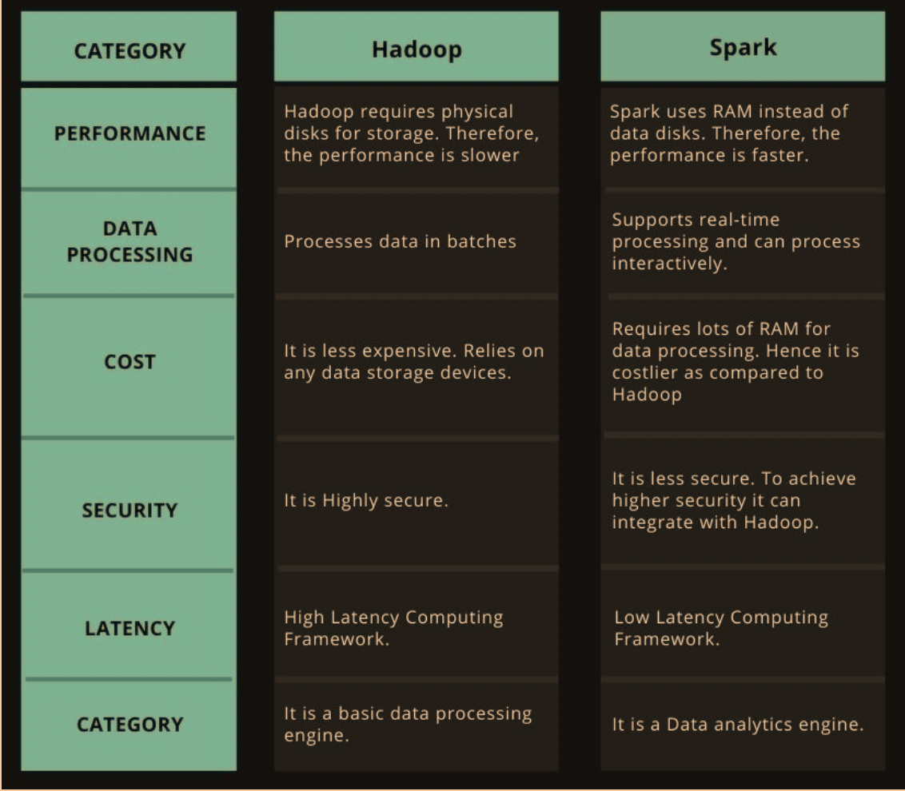

Hadoop and PySpark are both tools used in the realm of big data processing, but they serve different purposes and operate in distinct ways. Here's an overview of each:

Machine learning has revolutionized the way we interact with data. With the increasing volume of data, machine learning algorithms have become indispensable in understanding and extracting valuable insights from it. However, as the size of data continues to grow, traditional machine learning techniques become inefficient. This is where PySpark comes in.

PySpark is a powerful tool for building machine learning models on large datasets. It is an open-source framework that provides an interface for programming with Apache Spark. Apache Spark is a distributed computing engine designed to process large datasets efficiently. PySpark enables Python programmers to take advantage of Spark’s distributed processing capabilities, making it possible to build machine learning models on large datasets.

Hadoop and PySpark are both tools used in the realm of big data processing, but they serve different purposes and operate in distinct ways. Here's an overview of each:

Hadoop
Hadoop is an open-source framework developed by the Apache Software Foundation for storing and processing large datasets in a distributed computing environment. It consists of several components:

Hadoop Distributed File System (HDFS): A distributed file system that stores data across multiple machines in a reliable and fault-tolerant manner. It breaks down large files into smaller blocks and distributes them across a cluster of machines.

MapReduce: A programming model and processing engine for large-scale data processing. It divides tasks into smaller sub-tasks (map) and then aggregates the results (reduce).

YARN (Yet Another Resource Negotiator): A resource management layer for scheduling and managing cluster resources efficiently.

Hadoop Common: The common utilities and libraries that support the other Hadoop modules.

Key Features of Hadoop:

Scalability: Can handle petabytes of data across thousands of machines.
Fault Tolerance: Automatically replicates data to handle hardware failures.
Cost-Effective: Utilizes commodity hardware.
Flexibility: Can process structured and unstructured data.
PySpark
PySpark is an interface for Apache Spark in Python. Apache Spark is an open-source, distributed computing system that provides an alternative to the traditional Hadoop MapReduce model for large-scale data processing. Spark is known for its speed, ease of use, and sophisticated analytics capabilities.

Key Components of PySpark/Spark:

RDD (Resilient Distributed Dataset): The fundamental data structure of Spark, providing fault-tolerant and parallel processing capabilities.
DataFrames and Datasets: High-level APIs for structured data, which allow for SQL-like operations and advanced data manipulation.
Spark SQL: Module for working with structured data using SQL.
Spark Streaming: Enables scalable and fault-tolerant stream processing.
MLlib: A machine learning library for scalable machine learning algorithms.
GraphX: A library for graph processing.
Key Features of PySpark:

Speed: Executes in-memory computations, which makes it significantly faster than Hadoop’s MapReduce.
Ease of Use: High-level APIs in Java, Scala, Python, and R.
Advanced Analytics: Provides support for complex analytics, including machine learning and graph computations.
Flexibility: Can run on Hadoop, Kubernetes, Mesos, or standalone, and access diverse data sources like HDFS, Cassandra, HBase, or S3.
Comparing Hadoop and PySpark:

Processing Model: Hadoop uses a batch processing model, whereas PySpark supports both batch and real-time stream processing.
Performance: PySpark generally performs better than Hadoop MapReduce due to its in-memory computation capabilities.
Ease of Use: PySpark offers more user-friendly and high-level APIs compared to Hadoop MapReduce, making it easier to write and manage large-scale data processing jobs.
In summary, Hadoop is a robust, scalable framework for distributed storage and batch processing, while PySpark is a fast, flexible, and easy-to-use tool for both batch and stream processing, particularly well-suited for large-scale data analytics and machine learning.

